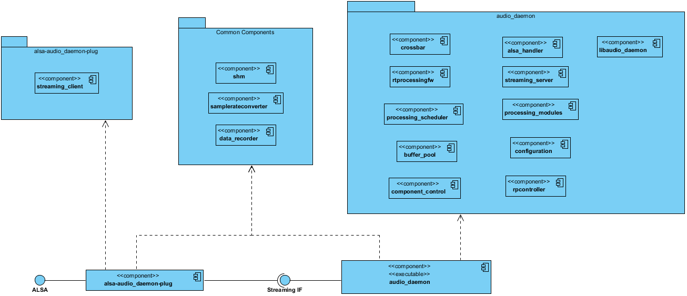

<!--
 * Copyright (C) 2018 Intel Corporation.All rights reserved.
 *
 * SPDX-License-Identifier: BSD-3-Clause
-->
# Design of jackless audio_daemon

This document contains the detailed design of the jackless audio_daemon.

## Deployment Diagram ##

The following diagram gives an overview of the required components of the audio_daemon:

## Constraints ##

**Scheduling**

<ol>
<li>Clock master of routing zone must have smaller period size than all ALSA clients of this zone.</li>
<li>Clients period size must be multiple of clock master period size to keep proper scheduling timing.</li>
</ol>

**Crossbar**

<ol>
<li>only allow connects between matching channel numbers</li>
