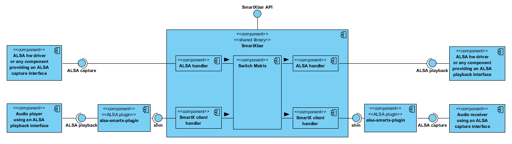

# Architectural Overview
@anchor arch_overview

<!---
###################################################################
## IMPORTANT NOTE ON ICD STRUCTURE
###################################################################
The documentation of each separate chapter is put into a different markdown file. Normally this
leads to a new page and a new entry in the navigation tree on the left side of the documentation on
the root level. This is not what we want to have. We want to have a hierarchy underneath a root chapter.
This is achieved by following these rules:

1. Start each new Markdown file with a level one heading, i.e. on the first line the normal heading text and
   on the second line underline your heading with '='
2. Add the doxygen command @page in the next line and use the name of the Markdown file, prefixed by 'md_'
   and without the file name postfix, as the name of the page. The title of the page is ignored and can be
   left empty
3. At the end of this page add the doxygen command @subpage with the name of your new page (prefixed with 'md_')
-->

The SmartXbar is a user-space library that allows to define and control all aspects of user-space audio routing and processing.
It is designed with the following key features in mind:

* Support of variable/native routing formats
* Handling of streams with independent period sizes, sample rates and sample formats
* Integration of processing blocks into individual processing zones
* Plug-in interface for third party algorithm integration
* Pure ALSA based solution
* Each routing path has its own constant latency
* Support of (a)synchronous sample rate conversion
* Early audio routing availability
* Guaranteed interoperability with Intel AVB stack

This provides a scalable solution from simple crossbar up to a powerful, full-flavored audio routing and processing engine.

The following diagram shows a simple overview of the interfaces provided and used by the SmartXbar:

The command and control interface *SmartXbar API* is a simple C++ API described in detail in the chapter @ref md_cuc_interfaces.

The streaming interfaces *ALSA playback* and *ALSA capture* are based on ALSA and described in detail in the chapter @ref md_streaming_if.

The architectural overview is comprised of the following chapters:

* @subpage md_audio_domain_model_routing
* @subpage md_audio_domain_model_processing
* @subpage md_thread_concept
* @subpage md_latency
* @subpage md_special_features
* @subpage md_streaming_if
* @subpage md_cuc_interfaces
* @subpage md_switch_matrix
* @subpage md_writing_processing_modules
* @subpage md_testing_processing_modules
* @subpage md_intel_processing_modules
* @subpage md_datasheet_smartXConfigParser
