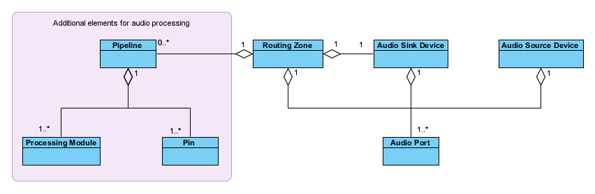
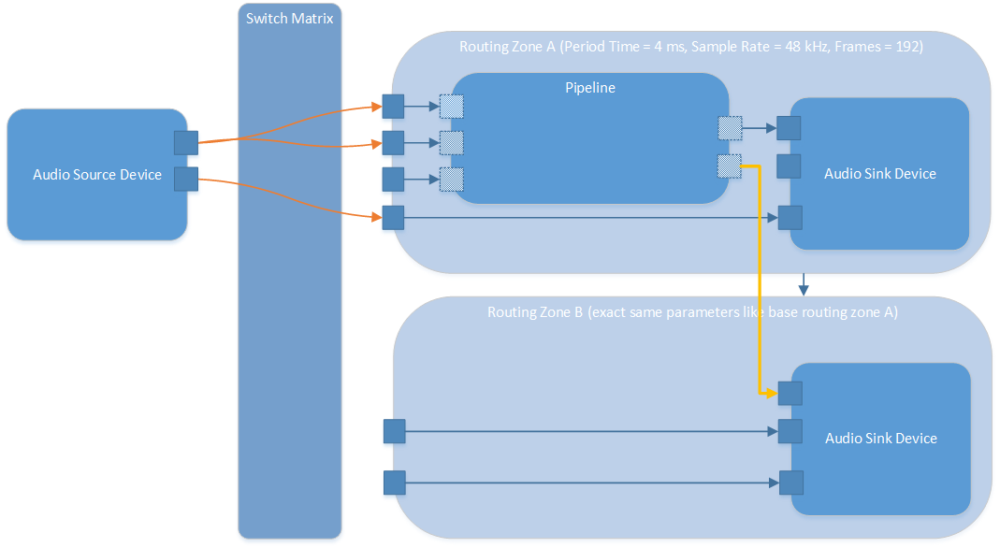

The Audio Domain Model for Processing Use-cases
===============================================
@page md_audio_domain_model_processing

In order to fully describe the audio system in the user-space for processing use-cases the [Audio Domain Model for routing use-cases](@ref md_audio_domain_model_routing) was extended by the following elements:

* @ref pin
* @ref processing_module
* @ref pipeline

###############################
@section pin Pin

A pin is used to represent an input or an output from or to a pipeline or a processing module. In case of
a processing module the pin can also represent a combined input and output. A pin has two properties, a name
and the number of channels. After all pins are created and assigned to pipelines and processing modules, the audio signal flow through the pipeline can be
defined by linking output pins to input pins. This flow will also internally determine the amount of memory required for the audio data. If for example there is
a separate input pin and a separate output pin added to a processing module this means two different memory buffers are required and the processing algorithm has to take care of copying
the audio samples from the input memory to the output memory associated to those pins. If there is only a combined input and output pin
added to a processing module, this means that there is only one buffer required and processing of the algorithm has to be done in-place.

###############################
@section processing_module Processing Module

A processing module is an implementation of an audio processing algorithm providing a standardized interface, which is defined by the SmartXbar. The interface consists of several
header files that are part of the set of public headers of the SmartXbar. They allow the customer to implement his own algorithms and deploy instances of them anywhere
in a pipeline.

###############################
@section pipeline Pipeline

A pipeline is used to host one or more processing modules and connect them flexibly with each other to form an audio processing chain according to the customer and project specific requirements.
There can be zero or exactly one pipeline per routing zone.

In the figure @ref f_audio_domain_model_processing "Audio Domain Model for processing use-cases" you can see the relationship of those elements and how they connect to the already existing elements of the
[Audio Domain Model for routing use-cases](@ref md_audio_domain_model_routing):

@anchor f_audio_domain_model_processing

###############################
@section admp_examples Examples

Here are some examples to illustrate different kind of setups:

##############
@subsection admp_example_1 Example showing all elements

The following figure shows an example about how all those elements can be combined and connected to create a customer specific routing and processing setup:

@anchor f_admp_example

@note Connections between two pins, two ports or one pin and one port are only allowed when the number of channels match.

As you can see, the routing zone has four input ports. Three of these input ports are connected to three input pins of the pipeline. The fourth input port
is directly connected to an input port of the audio sink device, which completely bypasses the processing for this connection. Two of the input pins are connected to two input pins of processing
module A. It will produce the output data for one output pin from the input data of these two input pins, which means the module could be a mixer module for example. The output of processing module A is then connected to the first port of the audio sink device.

The third input port of the routing zone is connected to the third input pin of the pipeline, which is connected to the input pin of processing module B. The output pin of processing module B is then connected via
the output pin of the pipeline to the second input port of the audio sink device. If there are two independent pins created and added to the processing module B, then the processing algorithm of module B
will have to take the audio samples from the memory of the input pin and copy it to the memory of the output pin during processing.
However, there could also be only one combined input and output pin, which means that the processing would have to be done in-place.

##############
@subsection admp_example_2 Example for connecting two sink devices to one pipeline

The following figure shows an example about how a second sink device can be connected to one pipeline of a different routing zone:

A few constraints have to be considered in order for that example to work. First of all, the 1:1 relation between a routing zone and a sink device is still valid. That means if a second sink device shall be linked to a pipeline, there has to be a second routing zone, where the second sink is linked to. The second routing zone has to be derived from the first one, that means the two routing zones have to be synchronous to each other. Also the parameters of the two sink devices have to match exactly. A multiple of the period time for the second sink device is not allowed. The pipeline always has to be added to the base routing zone. If those rules are followed, then an output pin of the base routing zones pipeline can simply be linked to a sink device input port of a derived routing zone.
