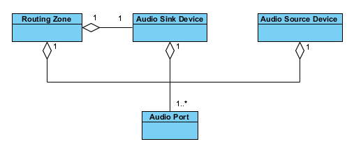
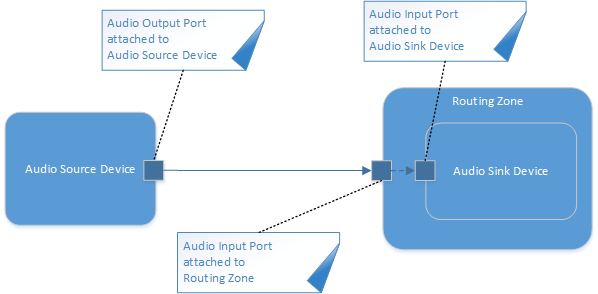
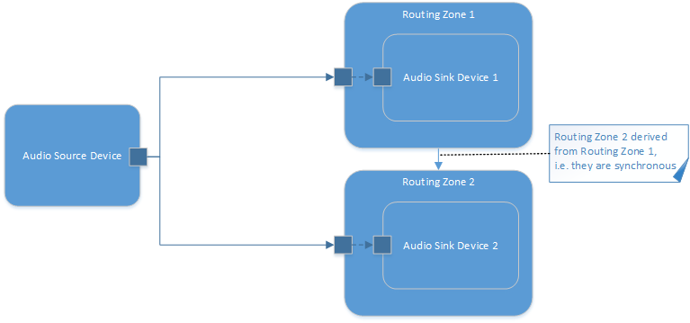

The Audio Domain Model for Routing Use-cases
============================================
@page md_audio_domain_model_routing

In order to fully describe the audio system in the user-space an Audio Domain Model was created that contains the following elements:

* @ref source_device
* @ref sink_device
* @ref port
* @ref zone

###############################
@section source_device Audio Source Device

An audio source device is an audio device that provides audio samples to the SmartXbar. This can either be an application via alsa-smartx-plugin
(playback direction from application point of view) or an ALSA capture device via the standard ALSA capture interface.

###############################
@section sink_device Audio Sink Device

An audio sink device is an audio device that receives audio samples from the SmartXbar. This can either be an application via alsa-smartx-plugin
(capture direction from application point of view) or an ALSA playback device via the standard ALSA playback interface.

###############################
@section port Audio Port

An audio port allows to group one or several channels of an audio device or a routing zone. It is also associated with a unique id that allows to connect
or disconnect it to another port. An audio port can be added as an output port to an audio source device or an input port to an audio sink device. An
audio port can also be added as an input port to a routing zone. Adding an input port to a routing zone is necessary when multiplexing several input ports
of a routing zone to several output ports of an audio sink device. Input ports for routing zones are also required if audio processing modules are inserted
into the routing zone.

###############################
@section zone Routing Zone

For every audio sink device one routing zone has to be created and linked with it. The routing zone is responsible for the scheduling of routing and
processing. It provides the clock for the switch matrix to deliver one period of audio samples when the audio sink devices have space for it in their ring buffer.
Routing zones can be derived from each other which means that their linked audio sink devices have to be synchronous to each other.
@note The derived routing zones must have the same period time or an integral multiple of the period time of their base routing zone (see @ref synchronous_zones).

In the figure @ref f_audio_domain_model_routing "Audio Domain Model for routing use-cases" you can see the relationship of those elements:

@anchor f_audio_domain_model_routing

A routing zone is linked to exactly one audio sink device. A routing zone can have one or more audio ports. An audio source and an
audio sink device must have at least one audio port.

###############################
@section adm_examples Examples

Here are some examples to illustrate different kind of setups:

##############
@subsection example_1 Simplest Example

This is the simplest possible setup where we have one audio source device, one routing zone, one audio sink device and the minimum required ports. With this setup
you are able to connect the output port of the audio source device to the input port of the routing zone. The input port of the routing zone is
linked to the input port of the audio sink device:

##############
@subsection example_2 Two Synchronous Routing Zones

In this setup we have one audio source device, two routing zones and two audio sink devices. The two routing zones are synchronized to each
other for being able to connect the audio source device to both routing zones:

##############
@subsection example_3 Two Synchronous Routing Zones including Multiplexing

In this setup we have one audio source device, two routing zones and two audio sink devices. The two routing zones are synchronized to each
other for being able to connect the audio source device to both routing zones. The audio sink device in this example is a 4 channel device. We
want to be able to connect a source port to either the first two channels or the second two channels of the audio sink device. Therefor we need to
add two stereo ports to the audio sink device and also two stereo ports to the routing zone. The ports from the routing zone then have to be linked
to the audio sink device ports. Now we are able to either connect the source port to the first port or to the second port:

