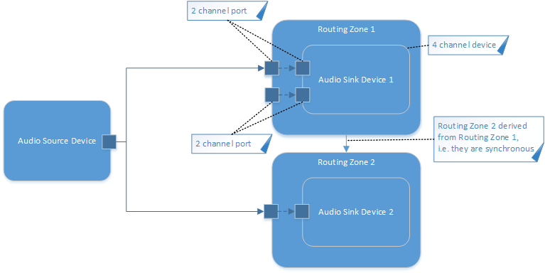

Command and Control Interfaces
==============================
@page md_cuc_interfaces

@attention The API is not thread-safe. The user has to take care that the API is not used from multiple threads concurrently.

@note The following code examples assume that the namespace IasAudio is imported into the application namespace to make the examples simpler.

################################################
@section general_procedure General Procedure when Using the API

The general procedure when using the API includes the following steps:

-# Create the SmartXbar instance
-# Check the version
-# Create all audio elements like e.g. audio source devices, audio sink devices, audio ports and routing zones and link them as desired
-# Start all routing zones and all audio source devices

@note Only after the audio source devices and audio sink devices are created via the SmartXbar API, audio applications like aplay or arecord are able to use the ALSA devices provided by the alsa-smartx-plugin. The ALSA devices
created by the SmartXbar API are not listed when executing *aplay -l* or *aplay -L* from the shell.

During the operation of the SmartXbar you can always add new audio elements as needed and start or stop them. When shutting down
the application you can simply destroy the SmartXbar which stops all running threads and cleans-up all created elements.

################################################
@section basics Starting Point for Using the SmartXbar API

The starting point for using the SmartXbar is via the header file IasSmartX.hpp. This is used to make an initial version check of the API and to instantiate the single
instance of the SmartXbar. There should be only one instance of the SmartXbar per ECU. Before actually using the SmartXbar it is important to check if the version
of the used library matches the version of the included header files:

~~~~~~~~~~{.cpp}
#include "audio/smartx/IasSmartX.hpp"

if (IasAudio::IasSmartX::isAtLeast(SMARTX_API_MAJOR, SMARTX_API_MINOR, SMARTX_API_PATCH) == false)
{
  // Version mismatch
  // ...

  return -1;
}

IasAudio::IasSmartX *smartx = IasAudio::IasSmartX::create();

// Start using the SmartXbar from that point on via the single instance pointer smartx
// ...
~~~~~~~~~~

It is also possible to get the version as a string e.g. to make log entries:

~~~~~~~~~~{.cpp}
std::cout << "The SmartXbar version is: " << IasAudio::IasSmartX::getVersion() << std::endl;
~~~~~~~~~~

In the future there might be some named features that can be checked for using the following method:

~~~~~~~~~~{.cpp}
if (IasAudio::IasSmartX::hasFeature("NAMED_FEATURE_XYZ") == true)
{
  // The feature is available
  // ...
}
else
{
  // The feature is not available
  // ...
}
~~~~~~~~~~

Currently this method always returns false because there are no named features yet.

To clean-up and free the resources used by the SmartXbar on application shutdown it should be destroyed using the following method:

~~~~~~~~~~{.cpp}
IasAudio::IasSmartX::destroy(smartx);
~~~~~~~~~~

################################################
@section events Receiving Asynchronous Events

The SmartXbar has the possibility to inform the application about internal state changes that the application might need to take some further actions.
One example are actions that can be triggered via the API of which the actual work is done inside a real-time thread later on during runtime. That means the work
is not finished when the API function call returns. A prominent example would be the IasAudio::IasIRouting::connect and IasAudio::IasIRouting::disconnect methods.
After the function call returns, only the command to trigger the establishement of a connection is done. To find out when the connection is really established an event is generated
to decouple the real-time thread from the normal non-real-time threads. Another example for the usage of events is to inform the application that the real-time thread has
observed an unrecoverable error when using an ALSA device. All those events are handled in the same manner. They are put into an event queue and have to be
consumed by the application by using the following method:

~~~~~~~~~~{.cpp}
IasAudio::IasSmartX::IasResult result;
IasAudio::IasEventPtr newEvent;
result = smartx->getNextEvent(&newEvent);
if (result == IasAudio::IasSmartX::eIasOk)
{
  // Event available
  // ...
}
~~~~~~~~~~

The IasAudio::IasSmartX::getNextEvent method immediately returns either with the info that there was an event available which is IasAudio::IasSmartX::eIasOk or with the info that there
is no event available which is IasAudio::IasSmartX::eIasNoEventAvailable. This makes the method suitable to be used for polling for new events. There is also the possibility to
make a blocking wait call until a new event is available:

~~~~~~~~~~{.cpp}
result = smartx->waitForEvent(100);
if (result == IasAudio::IasSmartX::eIasOk)
{
  // Event available
  result = smartx->getNextEvent(&newEvent);
}
~~~~~~~~~~

The parameter of the IasAudio::IasSmartX::waitForEvent method defines the timeout in msec after which the method returns regardless whether there is an event in the queue or not.

@attention If you are using this IasAudio::IasSmartX::waitForEvent method and the evaluation of the event in a separate thread remember that the SmartXbar API is not thread-safe and
appropriate actions have to be taken to ensure thread-safety.

##############
@subsection evaluate_event Evaluating an Event

In the previous section we discussed how to check for new events and remove them from the event queue. To evaluate the contents of the event we have to derive a class from the
IasAudio::IasEventHandler class and override the methods of the events we are interested in. Currently there are three events:

- The IasAudio::IasConnectionEvent informs about established or removed connections between an audio source port and an audio sink port or an audio source port and a routing zone port.
- The IasAudio::IasSetupEvent informs about unrecoverable errors of source devices or sink devices.
- The IasAudio::IasModuleEvent informs about incidents that occured in a processing module.

If we are interested in all events, we can implement a custom event handler like this:

~~~~~~~~~~{.cpp}
class MyEventHandler : public IasAudio::IasEventHandler
{
  virtual void receivedConnectionEvent(IasAudio::IasConnectionEvent *event)
  {
    // The event was a connection event
    // Do actual work ...
  }

  virtual void receivedSetupEvent(IasAudio::IasSetupEvent *event)
  {
    // The event was a setup event
    // Do actual work ...
  }

  virtual void receivedModuleEvent(IasAudio::IasModuleEvent* event)
  {
    // The event was a module event
    // Do actual work ...
  }
}
~~~~~~~~~~

Then after an event was received, we instantiate our custom event handler and call the dispatch method IasAudio::IasEvent::accept:

~~~~~~~~~~{.cpp}
MyEventHandler evHandler;
newEvent->accept(evHandler);
~~~~~~~~~~

Depending on the event type the accept method then calls the overriden
IasAudio::IasEventHandler::receivedConnectionEvent, IasAudio::IasEventHandler::receivedSetupEvent, or IasAudio::IasEventHandler::receivedModuleEvent
method of our custom handler.
In those methods we get a pointer to the specialized event class and can call the methods of the specialized events to get more information about the event context.

##############
@subsection evaluate_module_event Evaluating Module Events

In Section @ref evaluate_event we have discussed how a custom event
handler could separate the three different event types that are
supported by the SmartXbar. In the following, we will focus on the
event type IasAudio::IasModuleEvent. This is the event type that is
used by processing modules in order to signalize a state change in the
processing context.

To provide any module-specific details, module events are based on the
IasAudio::IasProperties class. An IasAudio::IasProperties object might
include one or several key-value pairs. A detailled description of
this mechanism is provided in @ref properties.

As described in Section @ref pipeline, the SmartXbar allows to execute
several processing modules within a pipeline. For this reason, the
custom event handler must be able to identify which module has
generated the event.

To support this, the IasAudio::IasProperties object of each module
event includes two key-value pairs that specify the typeName and the
instanceName of the originating module. The values that are associated
with the keys "typeName" and "instanceName" are of type std::string
and refer to the names that are used to create the module by means of
the function IasAudio::IasISetup::createProcessingModule.

In general, a processing module could support several event types. To
inform the event handler about the event type, each processing module
has to add a key-value pair to the IasAudio::IasProperties object.
The key of this pair shall be "eventType", while the value shall be
the int32_t representation of a module-specific enum type that
describes the event types supported by this module.

In case of the @ref md_datasheet_volume_loudness module, which is
included in the SmartXbar, the module-specific event types are defined
in IasVolumeCmd.hpp as follows:

~~~~~~~~~~{.cpp}
enum IasVolumeEventTypes
{
  eIasVolumeFadingFinished,           //!< The volume fade has finished
  eIasLoudnessSwitchFinished,         //!< The loudness switch has finished
  eIasSpeedControlledVolumeFinished,  //!< The speed controlled volume has finished
  eIasSetMuteStateFinished,           //!< The set mute state command has finished
};
~~~~~~~~~~

A detailled description of the module-specific event types is provided
by the module datasheet. For the volume/loudness module, the event
types are described in the Section @ref ds_vl_events of the @ref
md_datasheet_volume_loudness data sheet.

By means of this, our custom event handler can implement fhe following
function to dispatch the events coming from the different processing
modules and to identify the module-specific event type:

~~~~~~~~~~{.cpp}
  virtual void receivedModuleEvent(IasAudio::IasModuleEvent* event)
  {
    const IasProperties eventProperties = event->getProperties();
    std::string typeName = "";
    std::string instanceName = "";
    int32_t  eventType;
    eventProperties.get<std::string>("typeName", &typeName);
    eventProperties.get<std::string>("instanceName", &instanceName);
    eventProperties.get<int32_t>("eventType", &eventType);
    cout << "Received module event: "
         << "typeName = " << typeName << ", "
         << "instanceName = " << instanceName << ", "
	 << "eventType = " eventType << std::endl;
    if (typeName == "ias.volume")
    {
      // Example code for handling events from module ias.volume:
      std::string  pinName;
      IasProperties::IasResult result = eventProperties.get<std::string>("pin",  &pinName);
      (void)result;
      switch (eventType)
      {
        case static_cast<int32_t>(IasVolume::eIasVolumeFadingFinished):
          cout << "  volume fading finished for pin " << pinName << endl;
          break;
        case static_cast<int32_t>(IasVolume::eIasLoudnessSwitchFinished):
          cout << "  loudness switch finished for pin " << pinName << endl;
          break;
        case static_cast<int32_t>(IasVolume::eIasSpeedControlledVolumeFinished):
          cout << "  set speed controlled volume finished for pin " << pinName << endl;
          break;
        case static_cast<int32_t>(IasVolume::eIasSetMuteStateFinished):
          cout << "  set mute state finished for pin " << pinName << endl;
          break;
        default:
          cout << "  invalid event type" << endl;
      }
    }
    else if (typeName == "simplemixer")
    {
      // Functions for handling events from the module simplemixer have to be inserted here...
    }
    else
    {
      // Handling of events from further module types or from unknown module module types needs to be done here...
    }
  }
~~~~~~~~~~

################################################
@section setup Setup Interface

The setup interface is used to describe the audio system by the means of the @ref audio_domain_model_routing "Audio Domain Model for routing use-cases".
To get a handle to the setup interface the following method has to be called:

~~~~~~~~~~{.cpp}
IasAudio::IasISetup *setup = smartx->setup();
~~~~~~~~~~

The whole setup of the system has to be done using this interface. It can be used to create a static configuration once during startup or it can be used dynamically to add new components
during runtime. It is very common to have a mixture of both, a static setup and also some dynamic components that will be added and removed during runtime.

For a reference of the available methods please see the description of the IasAudio::IasISetup interface.

##############
@subsection create_source_device Create an Audio Source Device

@note The maximum allowed data buffer size for an audio device is 4 MB. The audio buffer size in bytes is calculated as:
      numChannels * sampleSize * periodSize * numPeriods

Here are the necessary steps to create an audio source device which provides an ALSA interface to an external application in form of a named alsa-smartx-plugin:

~~~~~~~~~~{.cpp}
IasAudio::IasAudioDeviceParams sourceParams;
sourceParams.name = "stereo0";
sourceParams.numChannels = 2;
sourceParams.samplerate = 48000;
sourceParams.dataFormat = IasAudio::eIasFormatInt16;
sourceParams.clockType = IasAudio::eIasClockProvided;
sourceParams.periodSize = 256;
sourceParams.numPeriods = 4;

IasAudio::IasAudioSourceDevicePtr newSourceDevice;
IasAudio::IasISetup::IasResult result = setup->createAudioSourceDevice(sourceParams, &newSourceDevice);
if (result == IasAudio::IasISetup::eIasOk)
{
  // Successfully created audio source device
}
~~~~~~~~~~

If you want to create an audio source device that reads audio data from an already existing ALSA device you would have to set the *clockType* in the
above code snippet like this:

~~~~~~~~~~{.cpp}
sourceParams.clockType = IasAudio::eIasClockReceived;
~~~~~~~~~~

Using the *clockType* IasAudio::eIasClockReceived requires that the clock of the ALSA device is synchronous to the clock of the routing zone
that shall be connected to this source device. If the clock of the ALSA device is asynchronous to the clock of the routing zone, you have
to configure the audio source device like this:

~~~~~~~~~~{.cpp}
sourceParams.clockType = IasAudio::eIasClockReceivedAsync;
~~~~~~~~~~

In this case an asynchronous sample rate converter is inserted into the signal path from the audio source device to the Switch Matrix.

For all audio source devices that read audio data from an already existing ALSA device (i.e., for all audio source devices of *clockType*
IasAudio::eIasClockReceived or IasAudio::eIasClockReceivedAsync), the name should be set to the actual name of the ALSA device, which has
to be defined in the asound.conf. It can also be set using the ALSA card ID and ALSA device ID if they are known:

~~~~~~~~~~{.cpp}
sourceParams.name = "hw:3,0";
~~~~~~~~~~

In general every ALSA name that is accepted by snd_pcm_open is allowed.

##############
@subsection create_output_port Create an Audio Output Port for the Audio Source Device

In order for the audio source device to be connectable through the Routing API an audio port has to be created and added to the audio source device:

~~~~~~~~~~{.cpp}
IasAudio::IasAudioPortParams portParams;
portParams.name = "stereo0_port";
portParams.numChannels = 2;
portParams.id = 123;
portParams.direction = IasAudio::eIasPortDirectionOutput;
portParams.index = 0;

IasAudio::IasAudioPortPtr newAudioPort;
result = setup->createAudioPort(portParams, &newAudioPort);
if (result == IasAudio::IasISetup::eIasOk)
{
  // Port successfully created
}
~~~~~~~~~~

The *name* is only used for debugging purposes and can be freely chosen. The *id* is used later on during the IasAudio::IasIRouting::connect
and IasAudio::IasIRouting::disconnect methods as the source *id*. The *id* value is not used otherwise,
it just has to be a unique 32-bit integer representing an audio output port. The *index* is required if multiple audio ports will be linked to one
audio source device and serves as the offset to the first channel of the audio source device represented by this audio port. In this example we only have one
audio port that we will link to the audio source device and the number of channels are identical, so the *index* has to be 0.
The *direction* determines whether we want to create an input port or an output port. As we are creating an audio source device the *direction* has to be
IasPortDirection::eIasPortDirectionOutput. After the port was created we will have to add this port to our previously created audio source device:

~~~~~~~~~~{.cpp}
result = setup->addAudioOutputPort(newSourceDevice, newAudioPort);
if (result == IasAudio::IasISetup::eIasOk)
{
  // Port successfully added
}
~~~~~~~~~~

##############
@subsection create_sink_device Create an Audio Sink Device

@note The maximum allowed data buffer size for an audio device is 4 MB. The audio buffer size in bytes is calculated as:
      numChannels * sampleSize * periodSize * numPeriods

Creating an audio sink device works pretty much the same like creating an audio source device. The only difference is the used datatype and the method for
creation:

~~~~~~~~~~{.cpp}
IasAudio::IasAudioDeviceParams sinkParams;
sinkParams.name = "speaker";
sinkParams.numChannels = 2;
sinkParams.samplerate = 48000;
sinkParams.dataFormat = IasAudio::eIasFormatInt16;
sinkParams.clockType = IasAudio::eIasClockProvided;
sinkParams.periodSize = 256;
sinkParams.numPeriods = 4;

IasAudio::IasAudioSinkDevicePtr newSinkDevice;
IasAudio::IasISetup::IasResult result = setup->createAudioSinkDevice(sinkParams, &newSinkDevice);
if (result == IasAudio::IasISetup::eIasOk)
{
  // Successfully created audio sink device
}
~~~~~~~~~~

Similar to @ref create_source_device "audio source devices", the SmartXBar can either provide an
audio sink device, which can be used by other applications as an ALSA capture device,
or it can use an already existing ALSA playback device as an audio sink device.

To create an audio sink device that is provided by the SmartXBar to be used by other applications,
you have to set the *clockType* to IasAudio::eIasClockProvided, as shown in the code snippet above. In order
to be able to provide the clock, the routing zone, which hosts the audio sink device, must be a
@ref synchronous_zones "Derived routing zone", which receives the clock from another routing zone
(which is the Base routing zone).

If you want to create an audio sink device that writes audio data into an already existing ALSA playback device,
you have to set the *clockType* according to

~~~~~~~~~~{.cpp}
sourceParams.clockType = IasAudio::eIasClockReceived;
~~~~~~~~~~

In this case, the routing zone receives the clock from the audio sink device.
This means that the routing zone must be either a @ref synchronous_zones "Base routing zone",
or -- if it is a Derived routing zone -- the clock of the the audio sink device must be synchronous
to the clock of the audio sink device that is hosted by the associated Base routing zone.

If you want to use an already existing ALSA device asynchronously in a Derived routing zone,
you have to set the *clockType* of the audio sink device according to

~~~~~~~~~~{.cpp}
sourceParams.clockType = IasAudio::eIasClockReceivedAsync;
~~~~~~~~~~

In this case, an asynchronous sample rate converter is inserted into the signal path from the
derived routing zone to the audio sink device. Therefore, the derived routing zone can run at the clock of the
base routing zone, while the ALSA playback device might run at an independent (asynchronous) clock.

##############
@subsection create_input_port Create an Audio Input Port for the Audio Sink Device

Creating an audio input port is similar to creating an audio output port for the audio source device:

~~~~~~~~~~{.cpp}
portParams.name = "speaker_port";
portParams.numChannels = 2;
portParams.id = -1;
portParams.direction = IasAudio::eIasPortDirectionInput;
portParams.index = 0;

IasAudio::IasAudioPortPtr newAudioPort;
result = setup->createAudioPort(portParams, &newAudioPort);
if (result == IasAudio::IasISetup::eIasOk)
{
  // Port successfully created
}
~~~~~~~~~~

The *id* of the audio sink device is not required because audio output ports cannot be directly connected to it. Thus the *id* of an audio sink device input port
always has to be set to -1. All other parameters have the same meaning like already described
for [creation of an audio output port](@ref create_output_port). In this example we reused the port parameter structure *portParams* from the output port.
This is ok because the parameters are copied internally and not required anymore after the call returns.
After the port was created, we will have to add this port to our previously created audio sink device:

~~~~~~~~~~{.cpp}
result = setup->addAudioInputPort(newSinkDevice, newAudioPort);
if (result == IasAudio::IasISetup::eIasOk)
{
  // Port successfully added
}
~~~~~~~~~~

##############
@subsection create_routing_zone Create a Routing Zone

Creating a routing zone can be done using the following lines of code:

~~~~~~~~~~{.cpp}
IasAudio::IasRoutingZoneParams zoneParams;
zoneParams.name = "stereo0_rzn";

IasAudio::IasRoutingZonePtr newRoutingZone;
result = setup->createRoutingZone(zoneParams, &newRoutingZone);
if (result == IasAudio::IasISetup::eIasOk)
{
  // Successfully created routing zone
}
~~~~~~~~~~

The *name* parameter is just used for debugging purposes and can be freely chosen.

##############
@subsection link_routing_zone_sink_device Link a Routing Zone with an Audio Sink Device

Every routing zone has to be linked to an audio sink device. Here
are the commands to accomplish that:

~~~~~~~~~~{.cpp}
result = setup->link(newRoutingZone, newSinkDevice);
if (result == IasAudio::IasISetup::eIasOk)
{
  // Successfully linked routing zone to audio sink device
}
~~~~~~~~~~

##############
@subsection create_input_port_rzn Create an Audio Input Port for the Routing Zone

@attention Before adding an audio input port, the [routing zone has to be linked with an audio sink device](@ref link_routing_zone_sink_device).

Creating an audio input port for the routing zone is similar as creating an audio input port for an audio sink device with one important major difference. The *id*
parameter is important for later being able to connect an output port of a source device with an input port of a routing zone.
The *id* can be the same as for the audio output port, as it only has to be unique per direction, i.e. in this case it has to be unique for all audio input ports.
These are the necessary instructions:

~~~~~~~~~~{.cpp}
portParams.name = "speaker_rznport";
portParams.numChannels = 2;
portParams.id = 123;
portParams.direction = IasAudio::eIasPortDirectionInput;
portParams.index = 0;

IasAudio::IasAudioPortPtr newAudioPort;
result = setup->createAudioPort(portParams, &newAudioPort);
if (result == IasAudio::IasISetup::eIasOk)
{
  // Port successfully created
}
~~~~~~~~~~

After the port was created, we will have to add this port to our previously created routing zone:

~~~~~~~~~~{.cpp}
result = setup->addAudioInputPort(newRoutingZone,newAudioPort);
if (result == IasAudio::IasISetup::eIasOk)
{
  // Port successfully added
}
~~~~~~~~~~

##############
@subsection link_rzn_input_port_with_sink_device_input_port Link the Routing Zone Input Port with the Sink Device Input Port

Now we have to define the connections between the routing zone input ports and the sink device input ports.

For the example shown in the following figure, we have to establish three connections:

* from the first input port of Routing Zone 1 to the first input port of Audio Sink Device 1
* from the second input port of Routing Zone 1 to the second input port of Audio Sink Device 1
* from the input port of Routing Zone 2 to the input port of Audio Sink Device 2

A conection from a routing zone input port to a sink device input port can be established as follows:

~~~~~~~~~~{.cpp}
IasAudio::IasAudioPortPtr sinkDeviceInputPort;
IasAudio::IasAudioPortPtr routingZoneInputPort;

... // Here we have to create the ports and add them to the
... // sink device and to the routing zone, respectively.

// Now we can link the routingZoneInputPort with the sinkDeviceInputPort.
result = setup->link(routingZoneInputPort, sinkDeviceInputPort);
if (result == IasAudio::IasISetup::eIasOk)
{
  // routingZoneInputPort successfully linked with sinkDeviceInputPort
}
~~~~~~~~~~

To unlink a routing zone input port from a sink device input port the following method has to be used: 
 
~~~~~~~~~~{.cpp}
setup->unlink(routingZoneInputPort, sinkDeviceInputPort);
~~~~~~~~~~

@note Routing zone has to be stopped before the ports can be unlinked. It is not possible to unlink the ports when the routing zone is active. 

##############
@subsection synchronous_zones Setting Up Synchronous Routing Zones

For every routing zone a separate worker thread is created to transfer the audio samples to the audio sink device. In a synchronous System
this is often not desired as this will introduce unnecessary context switches and additional scheduling latencies. Instead it is possible
to serve all synchronous sink devices by one single thread. For being able to setup such a synchronous
systems the concept of base routing zones and derived routing zones is introduced. A base routing zone provides the timing for all derived
routing zones. Derived routing zones can have the exact same timing like the base routing zone or they can have integral multiples of the
base routing zones period time. The **period time** defines the scheduling period of the worker thread. It is defined by the samplerate and the **period size**.
When defining the parameters of the derived routing zones it has to be ensured by design that their period time is the same or an integral multiple of it.
This implies that the base routing zone has to have the smallest period time of all routing zones. Here are some examples of valid derived routing zone parameters
for given base routing zone parameters:

**Base routing zone parameters**

Period time (msec) | Period size (frames) | Samplerate (kHz)
-------------------|----------------------|-----------------
4 | 192 | 48

**Possible derived routing zone parameters**

Integral multiple | Period time (msec) | Period size (frames) | Samplerate (kHz)
------------------|--------------------|----------------------|-----------------
1 | 4 | 192 | 48
1 | 4 | 96 | 24
1 | 4 | 48 | 12
2 | 8 | 384 | 48
2 | 8 | 192 | 24
2 | 8 | 96 | 12
3 | 12 | 576 | 48
3 | 12 | 288 | 24
3 | 12 | 144 | 12
4 | 16 | 768 | 48
4 | 16 | 384 | 24
4 | 16 | 192 | 12

In any case, the audio sink device, which is hosted by a routing zone,
@ref create_sink_device "has to be configured with the appropriate clockType parameter",
which has to consider whether the routing zone is a base routing zone or a derived routing zone.

To actually create a derived routing zone via the IasAudio::IasISetup API the following method has to be used. The derived routing zone parameters have to meet the requirements
described above in order for the method to succeed:

~~~~~~~~~~{.cpp}
IasRoutingZonePtr baseZone;
IasRoutingZonePtr derivedZone;
// Creation of the routing zones is done here
// ...
result = setup->addDerivedZone(baseZone, derivedZone);
if (result == IasAudio::IasISetup::eIasOk)
{
  // Successfully added derived routing zone
}
~~~~~~~~~~

##############
@subsection source_group_setup Creating a Source Group

To have different source devices grouped together, the user can create source groups.
Each source group has a unique name and several source device *ids*

The source devices must be created before adding them to a source group.
Let's assume there are three source devices with *ids* 0, 1 and 2 ( which might have mono, stereo and multichannel format).

To group them together to a group called "MediaPlayer", do like in the code example:

~~~~~~~~~~{.cpp}
setup->addSourceGroup("MediaPlayer",0);
setup->addSourceGroup("MediaPlayer",1);
setup->addSourceGroup("MediaPlayer",2);
~~~~~~~~~~

If a source group is not yet present, the function *addSourceGroup* will create it and add the source. If the group is already present, then only the device is added.
it is not possible to add same *id* twice.

To retrieve the created source group, do like this:

~~~~~~~~~~{.cpp}
IasSourceGroupMap sourceGroupMap = setup->getSourceGroups();
~~~~~~~~~~

##############
@subsection helper_functions Helper Functions to Setup Simple Use-cases

In the examples above we only had simple use-cases were we had exactly one audio port per device or routing zone with exactly the same number of channels.
For those use-cases there are some helper functions in the namespace IasAudio::IasSetupHelper which are described in the next chapters. The names are derived
from the name given in the IasAudio::IasAudioDeviceParams structure. For the audio device port name the string "_port" is appended, for the routing zone
name the string "_rz" is appended and for the routing zone port name the string "_rznport" is appended.

There are also some more functions provided to e.g. get the properties of some elements. For a complete reference see the description of the namespace
IasAudio::IasSetupHelper.

#######
@subsubsection create_source_helper Create an Audio Source Device Using the Helper Function

The following helper function creates an audio source device, an audio output port with the same number of channels and adds the output port to the source device:

~~~~~~~~~~{.cpp}
IasAudio::IasAudioDeviceParams sourceParams;
sourceParams.name = "stereo0";
sourceParams.numChannels = 2;
sourceParams.samplerate = 48000;
sourceParams.dataFormat = IasAudio::eIasFormatInt16;
sourceParams.clockType = IasAudio::eIasClockProvided;
sourceParams.periodSize = 256;
sourceParams.numPeriods = 4;

IasAudio::IasAudioSourceDevicePtr newSourceDevice;
result = IasAudio::IasSetupHelper::createAudioSourceDevice (setup, sourceParams, 123, &newSourceDevice);
if (result == IasAudio::IasISetup::eIasOk)
{
  // Successfully created audio source device and added output port with source id 123
}
~~~~~~~~~~

#######
@subsubsection create_sink_helper Create an Audio Sink Device Using the Helper Function

The following helper function creates an audio sink device, an audio input port with the same number of channels and adds the input port to the sink device.
It also creates a routing zone, an input port for the routing zone also with the same number of channels and adds the input port to the routing zone. The
audio sink device is linked with the routing zone:

~~~~~~~~~~{.cpp}
IasAudio::IasAudioDeviceParams sinkParams;
sinkParams.name = "speaker";
sinkParams.numChannels = 2;
sinkParams.samplerate = 48000;
sinkParams.dataFormat = IasAudio::eIasFormatInt16;
sinkParams.clockType = IasAudio::eIasClockProvided;
sinkParams.periodSize = 256;
sinkParams.numPeriods = 4;

IasAudio::IasAudioSinkDevicePtr newSinkDevice;
IasAudio::IasRoutingZonePtr newRoutingZone;
result = IasAudio::IasSetupHelper::createAudioSinkDevice(setup, sinkParams, 123, &newSinkDevice, &newRoutingZone);
if (result == IasAudio::IasISetup::eIasOk)
{
  // Successfully created audio sink device and added input port. Also created routing zone and added input port with source id 123
}
~~~~~~~~~~

##############
@subsection defining_simple_pipeline Defining a Simple Pipeline

The following sections will describe how to define a simple pipeline.

#######
@subsubsection creating_pipeline Creating a Processing Pipeline and Adding Input and Output Pins

To add processing capability to the SmartXbar setup, a processing pipeline has to be created. This is done like this:

~~~~~~~~~~{.cpp}
IasAudio::IasPipelineParams pipelineParams;
pipelineParams.name = "MyPipeline";
pipelineParams.periodSize = 192;
pipelineParams.samplerate = 48000;
IasPipelinePtr pipeline = nullptr;
result = setup->createPipeline(pipelineParams, &pipeline);
~~~~~~~~~~

@note The period size has to be a multiple of 4 when using the gcc compiler and a multiple of 8 when using the Intel compiler. This
is required due to optimizations being applied to the setup of the processing chain.

For being able to define the signal flow through the pipeline we need input and output pins. As an example
one input and one output pin will be created and added to the pipeline. First the input pin will be created

~~~~~~~~~~{.cpp}
IasAudioPinPtr pipelineInputPin = nullptr;
IasAudio::IasAudioPinParams pipelineInputParams;
pipelineInputParams.name = "pipelineInput";
pipelineInputParams.numChannels = 2;
result = setup->createAudioPin(pipelineInputParams, &pipelineInputPin);
~~~~~~~~~~

then the output pin will be created:

~~~~~~~~~~{.cpp}
IasAudioPinPtr pipelineOutputPin = nullptr;
IasAudio::IasAudioPinParams pipelineOutputParams;
pipelineOutputParams.name = "pipelineOutput";
pipelineOutputParams.numChannels = 2;
result = setup->createAudioPin(pipelineOutputParams, &pipelineOutputPin);
~~~~~~~~~~

then the input pin will be added to the pipeline:

~~~~~~~~~~{.cpp}
result = setup->addAudioInputPin(pipeline, pipelineInputPin);
~~~~~~~~~~

and then the output pin will be added to the pipeline:

~~~~~~~~~~{.cpp}
result = setup->addAudioOutputPin(pipeline, pipelineOutputPin);
~~~~~~~~~~

#######
@subsubsection adding_pipeline_to_rzn Adding the Pipeline to a Routing Zone

The pipeline now has to be added to a previously created routing zone:

~~~~~~~~~~{.cpp}
result = setup->addPipeline(newRoutingZone, pipeline);
~~~~~~~~~~

@note It is mandatory to do that, before the input and output pins of a pipeline can be linked to the routing zone input ports or the sink device input ports.

#######
@subsubsection creating_module Creating, Configuring and Initializing a Processing Module

To create, prepare the configuration and initialize a processing module, the following methods are required:

- IasAudio::IasISetup::createProcessingModule
- IasAudio::IasISetup::setProperties
- IasAudio::IasISetup::addProcessingModule
- IasAudio::IasISetup::createAudioPin
- IasAudio::IasISetup::addAudioInOutPin
- IasAudio::IasISetup::addAudioPinMapping

First of all a processing module instance has to be created. The two important parameters to do this are the
type name and the instance name. The type name is a unique name for a processing module type. This can be either
one of the type names included in the @ref md_intel_processing_modules, or a custom type name from a customer
implemented processing module.

The instance name has to be a unique name amongst all created processing modules for being able to address them
using the IasAudio::IasIProcessing::sendCmd method.

~~~~~~~~~~{.cpp}
IasProcessingModuleParams moduleParams;
moduleParams.typeName = "ias.volume";
moduleParams.instanceName = "MyVolume";
IasProcessingModulePtr volume = nullptr;
result = setup->createProcessingModule(moduleParams, &volume);
~~~~~~~~~~

After the module was successfully created the properties for this module have to be configured. Details about the
configuration can be found in the accompanying [datasheet of the processing module](@ref ds_vl_configuration). In this
case we are only setting the mandatory parameter:

~~~~~~~~~~{.cpp}
IasProperties volumeProperties;
volumeProperties.set<int32_t>("numFilterBands", 3);
setup->setProperties(volume, volumeProperties);
~~~~~~~~~~

Now everything is setup, besides the pin configuration. But before being able to setup the pin configuration, the
module instance has to be added to an existing pipeline:

~~~~~~~~~~{.cpp}
result = setup->addProcessingModule(pipeline, volume);
~~~~~~~~~~

After that it is possible to add the pin configuration. The pin configuration defines how many input, output or combined
input/output pins the module shall provide. The volume/loudness module only supports combined input/output pins according to the datasheet,
so we are creating one stereo input/output pin:

~~~~~~~~~~{.cpp}
IasAudioPinPtr volumePin = nullptr;
IasAudioPinParams pinParams;
pinParams.name = "stereo0";
pinParams.numChannels = 2;
result = setup->createAudioPin(pinParams, &volumePin);
~~~~~~~~~~

and adding it to the module:

~~~~~~~~~~{.cpp}
result = setup->addAudioInOutPin(volume, volumePin);
~~~~~~~~~~

#######
@subsubsection define_signal_flow Defining the Signal Flow through the Pipeline

Defining the signal flow through the pipeline is done by linking the previously created pins with each other in the desired sequence.
In our example we link the input pin of the pipeline with the input/output pin of the volume/loudness module. Then we link the
input/output pin of the volume/loudness module with the output pin of the pipeline:

~~~~~~~~~~{.cpp}
result = setup->link(pipelineInputPin, volumePin, eIasAudioPinLinkTypeImmediate);
// check the result
result = setup->link(volumePin, pipelineOutputPin, eIasAudioPinLinkTypeImmediate);
~~~~~~~~~~

#######
@subsubsection initializing_pipeline Initializing the Processing Pipeline

After the pipeline is created, the processing module is created and the required pins are created and linked, it is required
to initialize the pipeline. This is done in the following way:

~~~~~~~~~~{.cpp}
result = setup->initPipelineAudioChain(pipeline);
~~~~~~~~~~

#######
@subsubsection link_pins_to_ports Linking Pipeline Pins to Ports

Finally the pipeline input ports have to be linked to the routing zone input ports and the pipeline output pins
have to be linked to the sink device input ports:

~~~~~~~~~~{.cpp}
result = setup->link(routingZoneInputPort, pipelineInputPin);
// check the result
result = setup->link(sinkDeviceInputPort, pipelineOutputPin);
~~~~~~~~~~

@note This can only be done after the pipeline was added to a routing zone before, see @ref adding_pipeline_to_rzn.

##############
@subsection starting_smartxbar Starting the SmartXbar Worker Threads

After everything is configured and setup the SmartXbar worker threads have to be started. This can be done in two ways.
The simple way is by calling IasAudio::IasSmartX::start(). This method will start **all** currently configured SmartXbar
worker threads one after the other. The advantage is that there is nothing more to do.
The disadvantage is that you have little control over
what is actually started and react upon a failure that occurred during the start. Thus using this method is not recommended, only
for testing purposes or demos.

To have more control over what is being started you have to use the methods IasAudio::IasISetup::startRoutingZone and IasAudio::IasISetup::startAudioSourceDevice.
Starting a routing zone will automatically start the linked audio sink device. This means that the audio sink device has to be available
and ready for being opened before starting its routing zone. If the audio sink device is not available for being opened, the start will
fail.

The derived routing zones also have to be started explicitly. If a derived routing zone is started, and its base routing zone is not started yet, the scheduling of the derived routing zone is deferred until its base routing zone is started. However, the audio sink device is already opened, so it also has to be available and ready before starting the derived routing zone.

After all relevant audio source devices and routing zones are started the SmartXbar is fully operable.

################################################
@section routing Routing Interface

The routing interface is used to control the data flow from a source to a sink. To get a handle to the routing interface the following method
has to be called:

~~~~~~~~~~{.cpp}
IasAudio::IasIRouting *routing = smartx->routing();
~~~~~~~~~~

For a reference of the available methods please see the description of the IasAudio::IasIRouting interface.

################################################
@section processing Processing Interface

The processing interface is used to control the audio processing modules during runtime and to tune the audio processing modules during the sound tuning session.

For a reference of the available methods please see the description of the IasAudio::IasIProcessing interface.

###############################################
@section debug Debug Interface

The debug interface is used for debug purposes during runtime, like data probing etc.

For a reference of the available methods please see the description of the IasAudio::IasIDebug interface.
