Equalizer Car
=====
@page md_datasheet_equalizer_car

The car equalizer implements a pool of 2nd order IIR filters (“Biquad filters”), which allow a channel-specific 
equalization of the individual loudspeaker channels. By means of this, a car-specific compensation for the loudspeaker 
transfer functions and for the room-acoustic characteristics can be established. To do this, the car equalizer 
is located in the audio chain of the main cabin zone after the mixer, so that each audio channel refers to 
one loudspeaker. In this way, we can configure e.g. a high-frequency shelving filter if the loudspeaker mounting 
position leads to a dull character of the sound. An example for such a configuration of the KP 3.0 audio server is shown in Figure 1.

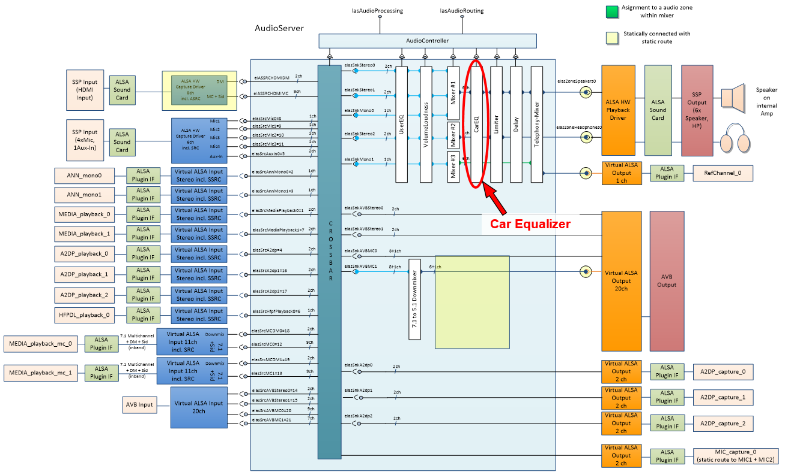

###############################
@section ds_mixer_general_info General Information

<table class="doxtable">
<tr><th align=left> Type name                 <td> "ias.equalizer"
<tr><th align=left> Pin configuration         <td> IasAudio::IasISetup::addAudioPinMapping
<tr><th align=left> Default module state      <td> on
</table>

The pin configuration for this module is done via the method IasAudio::IasISetup::addAudioPinMapping, which means
this module does out-of-place processing. There is no limit in
the number of pin mappings being added to an instance of the mixer module. In general it is most efficient to
add all pin mappings being processed to one single instance of the processing module.

###############################
@section ds_vl_configuration Configuration Properties

The following table describes all available properties that can be set via IasAudio::IasISetup::setProperties:

<table class="doxtable">
<tr><th> Struct      <th> Key                        <th> Value type  <th> Value <th> Mandatory <th> Description
<tr><td> -           <td> "numFilterStagesMax"       <td> int32_t  <td> 0 to 128    <td> yes       <td> The maximum number of filters.
<tr><td rowspan=2> - <td rowspan=2> "EqualizerMode"  <td> int32_t  <td> IasAudio::IasEqualizer::IasEqualizerMode::eIasUser  <td rowspan=2> yes <td> Set User mode.
<tr>

#######################
@subsection ds_equalizer_block_diagrem Block diagram

The car equalizer consists of a pool of Biquad filters, which can be configured at run-time via the tuning interface. By means of this, 
the filter parameters can be optimized during a tuning session without the necessity of re compiling the code of the equalizer. \n

Figure 2 shows the block diagram of the car equalizer for a configuration with four channels. The configuration, which is used 
for this example, includes two 5th order high-pass filters and two 4^th order low pass filters. Although the car equalizer offers 
such higher-order  filter types, these filters are internally factorized into cascades of 2nd order Biquad filter stages. 
As a consequence, 3rd order and 4th order filters are implemented by means of two Biquads, 5th order and 6^th order filters 
by means of three Biquads, and so on.

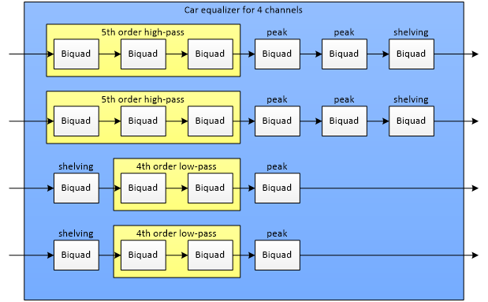

#######################
@subsection ds_equalizer_supported_filter_types Supported Filter Types

The filter types that are supported by the car equalizer are listed in Table 3. Most of these filter types are implemented 
by since Biquad filter stages  only the higher-order low-pass and high-pass filters are factorized into several Biquad filter 
stages as described in the previous section.

<table class="doxtable">
<tr><th> Type Identifier   <th> Filter type       
<tr><td> 0                 <td> Flat filter (bypass)   
<tr><td> 1                 <td> Peak filter, always 2nd order
<tr><td> 2                 <td> Low-pass filter of any order, based on Butterworth design
<tr><td> 3                 <td> High-pass filter of any order, based on Butterworth design
<tr><td> 4                 <td> Low-frequency shelving filter, 1st and 2nd order
<tr><td> 5                 <td> High-frequency shelving filter, 1st and 2nd order
<tr><td> 6                 <td> Band-pass filter, always 2nd order
</table>

Although the car equalizer does not enforce a hard limitation of the filter order in case of the low-pass and high-pass filter types, it is reasonable to avoid extreme high filter orders for accuracy reasons. Furthermore, an upper limit for the filter order results from the maximum number of Biquad stages per channel, which is defined via the configuration interface of the car equalizer (see Section 3.1 for details). In summary, the number of 1st order filters, 2nd order filters, 3rd order filters, etc. must be limited according to the following equation, where N_"Biquad Stages"  represents the maximum number of Biquad stages per channel.

\f[N_1+N_2+2(N_3+N_4 )+3(N_5+N_6 )+4(N_7+N_8 )+_{...}\leq N_{Biquad Stages}\f]

The structure of one Biquad filter stage is depicted in Figure 3. The transfer function if this 2nd order filter is determined by three non-recursive coefficients, b0, b1, and b2, and by two recursive coefficients, a1 and a2. The car equalizer automatically calculates these filter coefficients depending on the filter parameters, like filter type, filter order, characteristic frequency, Q factor, etc. 
Instructions how to calculate the coefficients of 2nd order IIR filters are provided e.g. by [1]. Calculation rules for higher-order low-pass and high-pass filters can be found in [2].

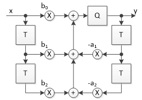

#######################
@section ds_equalizer_example_frequency_responses Example Frequency Responses
In this chapter, we show some example frequency responses for the filter types that are supported by the car equalizer.

#######################
@subsection ds_influence_of_the_bilinear_transform Influence of the Bilinear Transform

The filter design method, which is applied by the car equalizer to calculate the filter coefficients, is based on the equivalent 
time-continuous filter, which is transformed into the time-discrete domain by means of the Bilinear Transform, [1]. 
One property of the Bilinear Transform is that it applies a frequency warping in such a way that the time-continuous 
frequency range from 0 Hz to infinity is mapped onto the interval from 0 Hz to the Nyquist rate in the time-discrete domain according to [3]:

\f[ \omega'=\frac{2}{T}tan(\frac{\omega T}{2})= 2f_s tan(\pi \frac{f}{f_s} ) \f]

In this equation \f$\omega'\f$ and \f$\omega\f$ denote the frequencies in the time continuous domain and in the time discrete domain, respectively. Figure 4 depicts 
the frequency warping resulting from the Bilinear Transform for a sample rate of 48000 Hz. As a consequence, the frequency response of the time-discrete 
filter significantly differs from the desired frequency response at higher frequencies. To provide an example, the behaviour of a time discrete 
filter at 15000 Hz corresponds to the behaviour of the time-continuous filter at 22866 Hz.

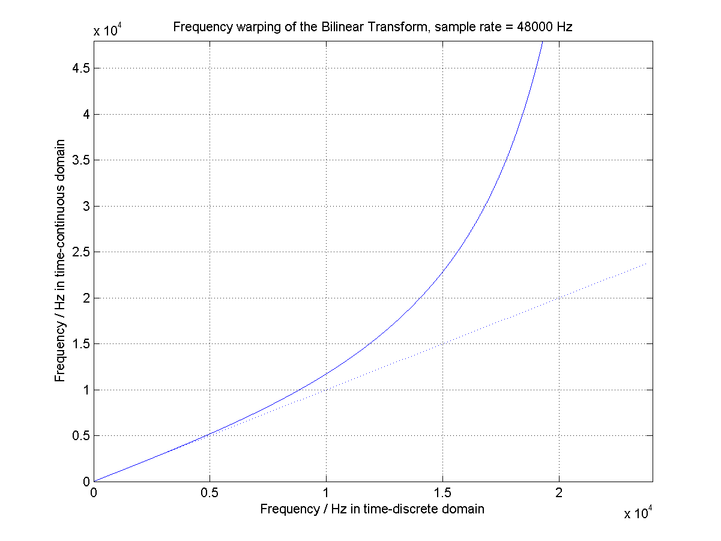

picture picture

In order to mitigate the influence of this frequency warping, we have to consider this effect already during the design of the equivalent time-continuous filter, 
which acts as the basis for the Bilinear Transform. In order to guarantee that the resulting time-discrete filter meets the desired characteristic frequency \f$ f_C \f$, 
we have to “pre warp” the characteristic frequency of the time-continuous filter. However, although the car equalizer internally applies this pre-warping, there still 
remains a mismatch between the intended frequency response and the resulting frequency response above the characteristic frequency \f$ f_C \f$. Examples for this behaviour 
will be shown in the following sections.

#######################
@subsection ds_band_pass_filter Band-Pass filter

The filter order of a band-pass filter is always even. The car equalizer supports band-pass filters with a filter order of two. A band-pass filter is characterized by its center frequency and its filter quality (Q factor), which influences the bandwidth of the filter according to [4]:
\f[ \Delta f=f_2 - f_1 = \frac{f_C}{Q} \f]
The frequencies \f$ f_2 \f$ and \f$ f_1 \f$ are the “corner” frequencies, which refer to an amplitude 3 dB below the peak value.
To provide an example, Figure 5 shows the amplitude responses for band pass filters with a center frequency of 1000 Hz and various filter qualities. Thanks to the pre-warping, the center frequencies of the time discrete filters are exactly located at 1000 Hz. However, the frequency warping becomes obvious in such a way that the amplitude responses tend towards -∞ dB for frequencies close to the Nyquist rate (24000 Hz).

#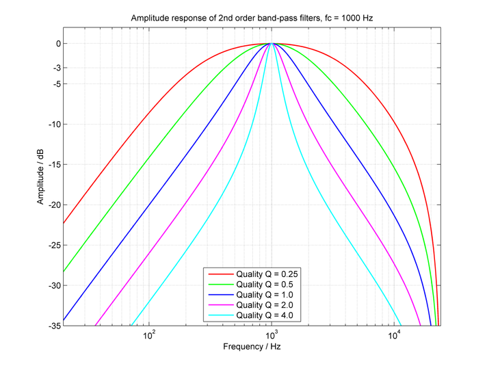

<B>
Figure 5. Amplitude responses for band-pass peak filters, \f$ f_C = 1000 Hz \f$ , \f$Q \in \f$ [
 0.25,
 0.5 ,
 1.0 ,
 2.0 ,
 4.0 
].</B>

#######################
@subsection ds_peak_filter Peak filter

Peak filters can be used to amplify or to attenuate a frequency band around a center frequency \f$ f_C \f$. According to Figure 6, a peak filter can be composed of a band-pass filter 
and a direct connection (bypass). As a consequence, the band-pass filter influences the frequency range around \f$ f_C \f$, whereas outside this frequency band the transmission 
behaviour is dominated by the bypass. 

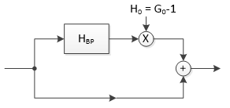

Figure 7, Figure 8, and Figure 9 show the amplitude responses for peak filters with different filter qualities \f$ Q_\infty \in [2.0, 1.0, 0.5] \f$, center frequencies\f$ f_C \in [100 Hz, 1000 Hz, 10000 Hz]\f$, 
and filter gains \f$G_0 \f$ between -18 dB and 18 dB. \n

Due to the fact that the filter quality \f$Q_\infty \f$ refers to the quality of the underlying band-pass filter, it is in general not possible to meter the quality \f$Q_\infty \f$ directly from the amplitude 
response plot, i.e. by analysing the bandwidth defined by -3 dB corner frequencies. This becomes obvious if we consider a peak filter with a gain \f$G_0 \f$of 3 dB or less. In this case, 
the bandwidth becomes infinity or is even undefined, so that this approach cannot be used to determine the filter quality. \n

However, it is possible to determine an approximation of the filter quality \f$Q_\infty\f$ if we consider the amplitude response of a peak filter with a high filter 
gain \f$G_0 \f$ of 9 dB or more. In this case, we can again apply the bandwidth definition based on the -3 dB corner frequencies. 

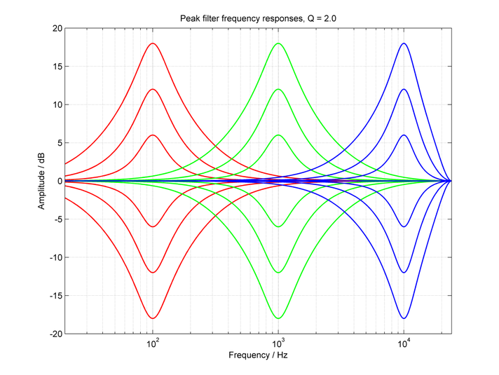

<B>
Figure 7. Amplitude responses for peak filters with quality, \f$ Q = 2.0 \f$ and \f$ f_C \in \f$ [
 100 Hz,
 1000 Hz ,
 10000Hz 
].</B>

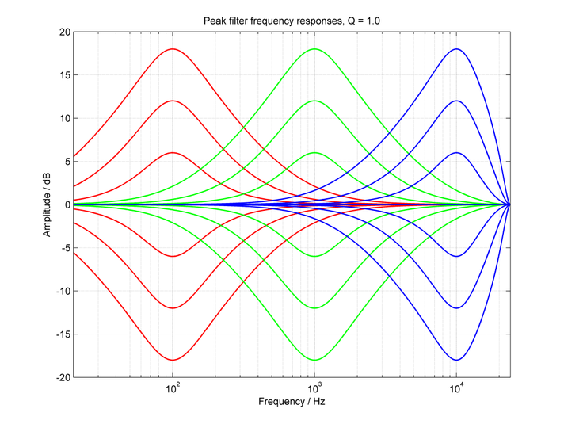

<B>
Figure 8. Amplitude responses for peak filters with quality, \f$ Q = 1.0 \f$ and \f$ f_C \in \f$ [
 100 Hz,
 1000 Hz ,
 10000Hz 
].</B>

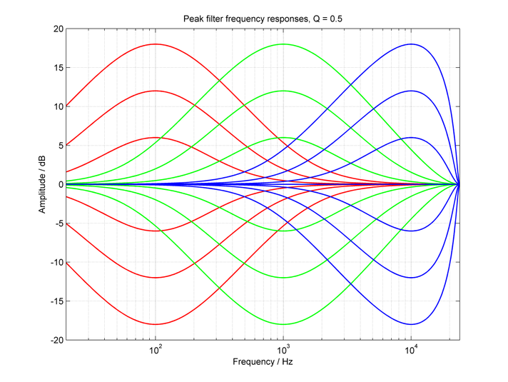

<B>
Figure 9. Amplitude responses for peak filters with quality, \f$ Q = 0.5 \f$ and \f$ f_C \in \f$ [
 100 Hz,
 1000 Hz ,
 10000Hz 
].</B>

#######################
@subsection ds_butterworth_low_pass_filter  Butterworth Low-Pass Filter
As already mentioned in Section 2, the car equalizer supports low-pass and high-pass filters of any order. To do this, the car equalizer internally factorizes a higher-order low-pass and high-pass filter into a cascade of 2nd order Biquad filters. Although this factorization is done automatically, the user has to consider that e.g. a 5th order low-pass filter requires three Biquad filters, which influences the number of Biquad stages that have to be reserved (see Section 2.3 and Section 3.1 for details).
Figure 10 shows the amplitude responses for Butterworth high-pass filters with a cut-off frequency of 100 Hz and with filter orders of up to six. Although the car equalizer does not enforce a hard limitation of the filter order in case of the low-pass and high-pass filter types, it is reasonable to avoid extreme high filter orders for accuracy reasons.

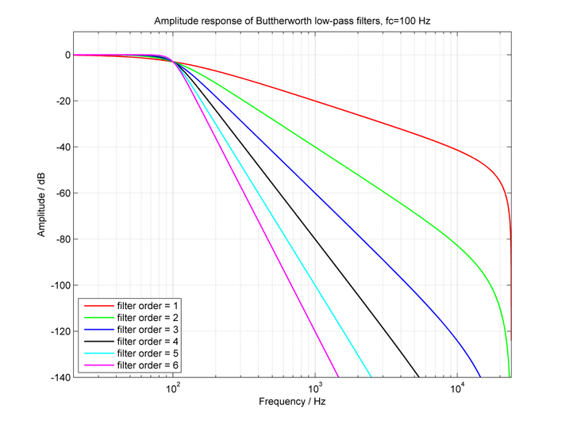
<B>Figure 10. Amplitude responses for Butterworth low-pass filters with \f$ f_C =100 Hz \f$ and various filter orders.</B>

#######################
@subsection ds_butterworth_high_pass_filter Butterworth High-Pass Filter

Most of the remarks that have been mentioned in Section 4.4 are also applicable for high-pass filters. 
Figure 11 shows the amplitude responses for Butterworth high-pass filters with a cut-off frequency of 1000 Hz and with filter orders of up to six. 

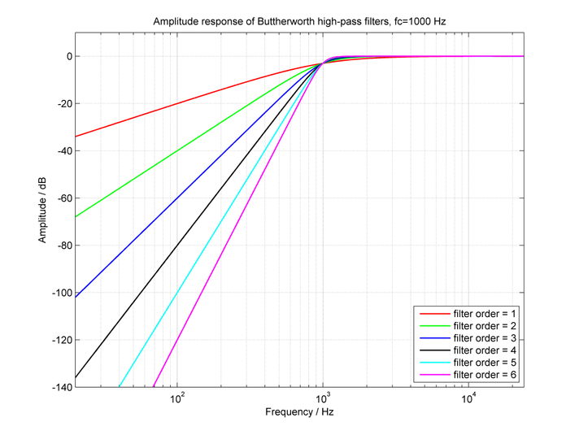
<B>Figure 11. Amplitude responses for Butterworth high-pass filters with \f$ f_C =1000 Hz \f$ and various filter orders.</B>

#######################
@subsection ds_low_frequency_shelving_filter Low-Frequency Shelving Filter
Similar to peak filters, also shelving filters allow to amplify or to attenuate a specific frequency range. However, in contrast to peak filters, shelving filters have only 
one slope, i.e. they amplify (or attenuate) the complete frequency range below a given frequency \f$f_C\f$ (in case of the low-frequency shelving filter) or above a given frequency \f$f_C\f$ 
(in case of the high-frequency shelving filter).
The car equalizer supports shelving filters of first or second order. Second order filters have a steeper slope than first order filters, i.e. their transition band is narrower.
Figure 12 and Figure 13 show the amplitude responses of low-frequency shelving filters of first order and of second order, respectively. The depicted filters implement filter gains \f$G_0\f$ between -15 dB and 15 dB.

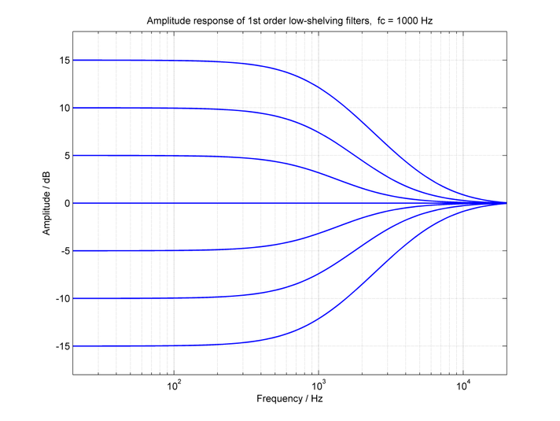
<B>Figure 12. Amplitude responses for 1st order low-frequency shelving filters with \f$ f_C =1000 Hz \f$.</B>

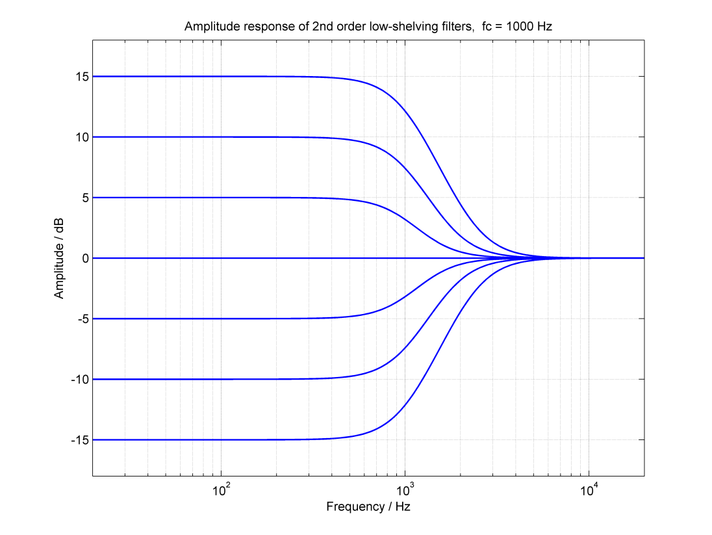
<B>[Figure 13. Amplitude responses for 2nd order low-frequency shelving filters with \f$f_C =1000 Hz \f$.</B>

#######################
@subsection ds_high_frequency_shelving_filter High-Frequency Shelving Filter
Figure 14 and Figure 15 show the amplitude responses of high-frequency shelving filters of first order and of second order, respectively. The depicted filters implement filter gains \f$G_0\f$ between -15 dB and 15 dB.

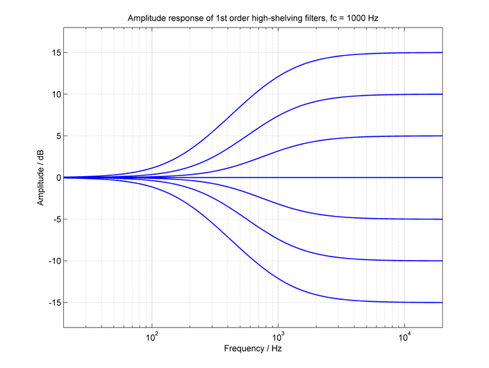
<B>Figure 14. Amplitude responses for 1st order high-frequency shelving filters with \f$ f_C =1000 Hz \f$.</B>

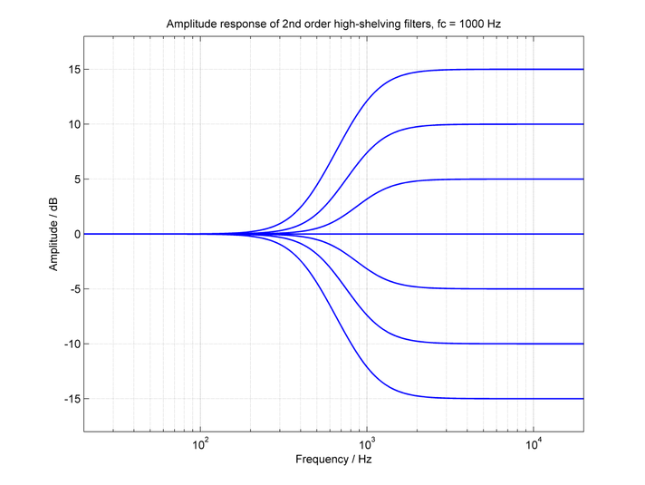
<B>Figure 15. Amplitude responses for 2nd order high-frequency shelving filters with \f$f_C =1000 Hz \f$.</B>

###############################
@section ds_mixer_control Runtime Processing Control Properties

The following table describes all commands that can be received by an instance of the equalizer
module via the method IasAudio::IasIProcessing::sendCmd. They are typically used during runtime to control
the processing:

<table class="doxtable">
<tr><th> Command <th> Key <th> Value type <th> Value range <th> Description
<tr><td rowspan=2> Set module state <td> "cmd"             <td> int32_t  <td> IasAudio::IasMixer::eIasSetModuleState  <td> Set the module state, i.e. turn the module on or off.
<tr>                                <td> "moduleState"     <td> std::string <td> "on", "off"                             <td> "on" to turn the module on, or "off" to turn it off.

<tr><td rowspan=4> Set number of filters <td> "cmd"        <td> int32_t  <td>  IasAudio::IasEqualizer::eIasCarModeSetEqualizerNumFilters <td> Set number of filters
<tr>                                <td> "pin"             <td> std::string <td>  Valid pin name              <td> A valid input or combined input/output. 
<tr>                                <td> "channelIdx"      <td> int32_t  <td>  0 to Number of channels     <td> Number of channel, whose number of filter stages has to be set
<tr>                                <td> "numFilters"      <td> int32_t  <td>  0 to numFilterStagesMax     <td> Number of filter stages

<tr><td rowspan=9> Set filter params <td> "cmd"            <td> int32_t  <td> IasAudio::IasEqualizer::eIasCarModeSetEqualizerFilterParams <td> Set filter params
<tr>                                 <td> "pin"            <td> std::string <td> Valid pin name               <td> A valid input or combined input/output pin name for which the volume shall be changed. 
<tr>                                 <td> "channelIdx"     <td> int32_t  <td> 0 to Number of channels in stream <td> Channel Id, whose filter parameters shall be updated, Id=0 is the first channel and so on
<tr>                                 <td> "filterId"       <td> int32_t  <td> 0 to Number of filters in channel <td> Id of filter stage, whose data shall be updated
<tr>                                 <td> "freq"           <td> int32_t  <td> 10 to 9999999                <td> Frequency [Hz] of the filter
<tr>                                 <td> "gain"           <td> int32_t  <td> -240 to 240                  <td> Gain [dB/10], required only for peak and shelving filters
<tr>                                 <td> "quality"        <td> int32_t  <td> 1 to 10000                   <td> Quality, required only for band-pass and peak filters
<tr>                                 <td> "type"           <td> int32_t  <td> IasAudio::IasAudioFilterTypes::eIasFilterTypeFlat  
																			   IasAudio::IasAudioFilterTypes::eIasFilterTypePeak  
																			   IasAudio::IasAudioFilterTypes::eIasFilterTypeLowpass  
																			   IasAudio::IasAudioFilterTypes::eIasFilterTypeHighpass  
																			   IasAudio::IasAudioFilterTypes::eIasFilterTypeLowShelving  
																			   IasAudio::IasAudioFilterTypes::eIasFilterTypeHighShelving  
																		   	   IasAudio::IasAudioFilterTypes::eIasFilterTypeBandpass      <td> Filter type
<tr>                                 <td> "order"          <td> int32_t  <td> 1 to 20                      <td> Filter order
</table>

###############################
@section ds_mixer_return Runtime Processing Return Properties

The following table describes all return properties that can be received from an instance of the equalizer
module when the IasAudio::IasIProcessing::sendCmd method is called.

<table class="doxtable">
<tr><th> Response for command <th> Key           <th colspan=2> Value type  <th> Value range  <th> Description
<tr><td rowspan=4> Get number of filters <td> "cmd"        <td> int32_t  <td> Input  <td>  IasAudio::IasEqualizer::eIasCarModeGetEqualizerNumFilters <td> Get number of filters
<tr>                                 <td> "pin"            <td> std::string <td> Input  <td>  Valid pin name              <td> A valid input or combined input/output pin name. 
<tr>                                 <td> "channelIdx"     <td> int32_t  <td> Input  <td>  0 to Number of channels     <td> Number of channel, whose number of filter stages has to be get.
<tr>                                 <td> "numFilters"     <td> int32_t  <td> Output <td>  0 to numFilterStagesMax     <td> Number of filter stages.
<tr><td rowspan=9> Get filter params <td> "cmd"            <td> int32_t  <td> Input  <td>  IasAudio::IasEqualizer::eIasCarModeGetEqualizerFilterParams <td> Get filter params.
<tr>                                 <td> "pin"            <td> std::string <td> Input  <td>  Valid pin name              <td> A valid input or combined input/output pin name. 
<tr>                                 <td> "channelIdx"     <td> int32_t  <td> Input  <td>  0 to Number of channels in stream <td> Channel Id, whose filter parameters shall be updated, Id=0 is the first channel, Id=1 second and so on.
<tr>                                 <td> "filterId"       <td> int32_t  <td> Input  <td>  0 to Number of filters in channel <td> Id of filter stage, whose data has to be get.
<tr>                                 <td> "freq"           <td> int32_t  <td> Output <td>  10 to 9999999               <td> Frequency [Hz] of the filter.
<tr>                                 <td> "gain"           <td> int32_t  <td> Output <td>  -240 to 240                 <td> Gain [dB], required only for peak and shelving filters.
<tr>                                 <td> "quality"        <td> int32_t  <td> Output <td>  1 to 10000                  <td> Quality, required only for band-pass and peak filters.
<tr>                                 <td> "type"           <td> int32_t  <td> Input  <td>  IasAudio::IasAudioFilterTypes::eIasFilterTypeFlat  
																			   IasAudio::IasAudioFilterTypes::eIasFilterTypePeak  
																			   IasAudio::IasAudioFilterTypes::eIasFilterTypeLowpass  
																			   IasAudio::IasAudioFilterTypes::eIasFilterTypeHighpass  
																			   IasAudio::IasAudioFilterTypes::eIasFilterTypeLowShelving  
																			   IasAudio::IasAudioFilterTypes::eIasFilterTypeHighShelving  
																		   	   IasAudio::IasAudioFilterTypes::eIasFilterTypeBandpass                  <td> Filter type
<tr>                                 <td> "order"          <td> int32_t  <td> Output <td>  1 to 20                     <td> Filter order

</table>

