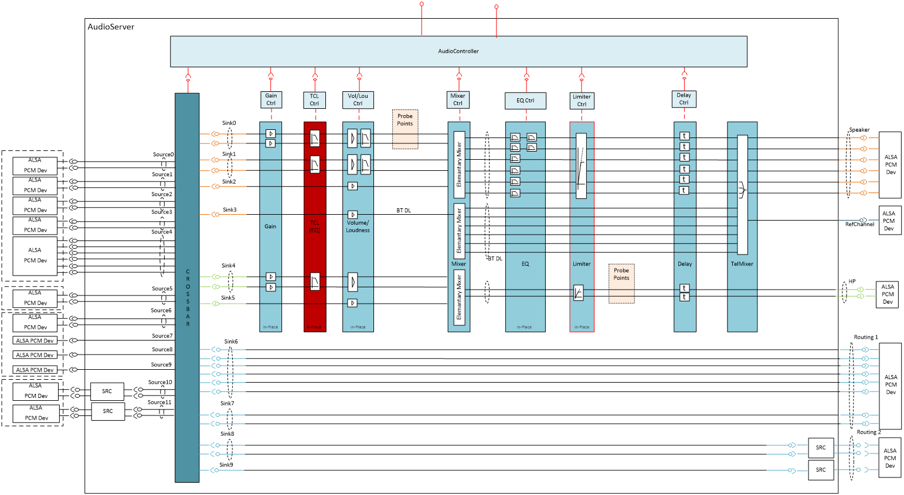
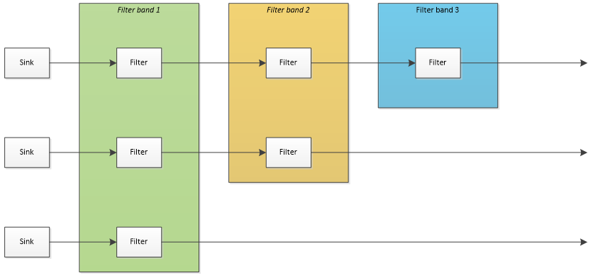

Equalizer User
=====
@page md_datasheet_equalizer_user
The user equalizer gives the end user in the car the possibility to adapt the gain of certain frequency ranges of the audio signal. 
Depending on the users wishes he can accentuate the bass or the treble frequencies. \n

The user equalizer component of the KP3.0 audio subsystem follows the rules of the audio server framework  it is divided into four 
parts - a shell, a core, a configuration component and a control interface. It processes audio data of logical sinks, which are 
provided by the crossbar. The user equalizer component is normally placed before the mixer (see marked block in the picture below). 
The processing is a block based data processing and the block size depends on the configured frame/period size of the overall processing 
chain. \n
The user equalizer component gets its configuration from the configuration DLL of audio server, which is loaded at system start up. 
It can be controlled by the audio processing interface and the audio tuning interface. 

###############################
@section ds_equalizer_general_info General Information

<table class="doxtable">
<tr><th align=left> Type name                 <td> "ias.equalizer"
<tr><th align=left> Pin configuration         <td> IasAudio::IasISetup::addAudioPinMapping
<tr><th align=left> Default module state      <td> on
</table>

The pin configuration for this module is done via the method IasAudio::IasISetup::addAudioPinMapping, which means
this module does out-of-place processing. There is no limit in
the number of pin mappings being added to an instance of the equalizer module. In general it is most efficient to
add all pin mappings being processed to one single instance of the processing module.

###############################
@section ds_vl_configuration Configuration Properties

The following table describes all available properties that can be set via IasAudio::IasISetup::setProperties:

<table class="doxtable">
<tr><th> Struct      <th> Key                        <th> Value type  <th> Value <th> Mandatory <th> Description
<tr><td> -           <td> "numFilterStagesMax"       <td> int32_t  <td> 0 to 128    <td> yes       <td> The maximum number of filters.
<tr><td rowspan=2> - <td rowspan=2> "EqualizerMode"  <td> int32_t  <td> IasAudio::IasEqualizer::IasEqualizerMode::eIasUser  <td rowspan=2> yes <td> Set User mode.
<tr>                                                 <td> int32_t  <td> IasAudio::IasEqualizer::IasEqualizerMode::eIasCar   <td> Set Car mode.

</table>

#######################
@subsection ds_equalizer_internal_structure Internal Structure

The internal structure of the user equalizer component is depicted below.

The data for every sink is passed through the configured filter bands. From the picture one can see that every sink can have its own setting of how many filter bands shall be processed.

##############
@subsection ds_equalizer_balance Default setup of the filters

By default, the user equalizer is configured with the following filter parameters, 
depending on the number of filter bands:

* Only one filter band:
 * Filter type: Peak filter
 * Characteristic frequency: 1000 Hz
 * Quality: 1.0
 * Order: 2
 * Gain: 0 dB
 \n\n
 
* Two filter bands:
 * Band 0:
  * Filter type: Peak filter
  * Characteristic frequency: 50 Hz
  * Quality: 0.8
  * Order: 2
  * Gain: 0 dB
 * Band 1:
  * Filter type: High shelving filter
  * Characteristic frequency: 10000 Hz
  * Quality: 1.0
  * Order: 2
  * Gain: 0 dB
 \n\n
  
* Three filter bands:
 * Band 0:
  * Filter type: Peak filter
  * Characteristic frequency: 50 Hz
  * Quality: 0.8
  * Order: 2
  * Gain: 0 dB
 * Band 1:
  * Filter type: Peak filter
  * Characteristic frequency: 1000 Hz
  * Quality: 1.0
  * Order: 2
  * Gain: 0 dB
 * Band 2:
  * Filter type: High shelving filter
  * Characteristic frequency: 10000 Hz
  * Quality: 1.0
  * Order: 2
  * Gain: 0 dB
 \n\n

* More than three filter bands:
The filters are ordered equidistantly on a log-frequency axis between 50 HZ and 12000 Hz. For the center frequency, the following formular is used:\n

\f[
fc = 10^{[log_{10}(50)+(\frac{filterband}{NumFilterbands})*(log_{10}(12000)-log_{10}(50))]}
\f]

The filters are all peak filters with an order of 2 and a quality of 1.0.

##############################
@section ds_equalizer_control Runtime Processing Control Properties

The following table describes all commands that can be received by an instance of the equalizer
module via the method IasAudio::IasIProcessing::sendCmd. They are typically used during runtime to control
the processing:

<table class="doxtable">
<tr><th> Command <th> Key <th> Value type <th> Value range <th> Description
<tr><td rowspan=2> Set module state <td> "cmd"            <td> int32_t  <td> IasAudio::IasEqualizer::eIasSetModuleState  <td> Set the module state, i.e. turn the module on or off.
<tr>                                <td> "moduleState"    <td> std::string <td> "on", "off"                             <td> "on" to turn the module on, or "off" to turn it off.
<tr><td rowspan=4> Set equalizer    <td> "cmd"            <td> int32_t  <td> IasAudio::IasEqualizer::eIasUserModeSetEqualizer <td> Set a new value of gain.
<tr>                                <td> "pin"            <td> std::string <td> Valid pin name                          <td> A valid input pin name for which the input gain offset shall be changed.
<tr>                                <td> "filderId"       <td> int32_t  <td> 0 to numFilterStagesMax                 <td> Id of filter stage, whose data shall be updated
<tr>                                <td> "gain"           <td> int32_t  <td> -240 to 240                             <td> The new gain offset in 1/10th dB.
<tr><td rowspan=3> Set gradient     <td> "cmd"            <td> int32_t  <td> IasAudio::IasEqualizer::eIasUserModeSetRampGradientSingleStream <td> Set the gradient that is used for ramping the filter gain
<tr>                                <td> "pin"            <td> std::string <td> Valid pin name                          <td> A valid input pin name for which the input gain offset shall be changed.
<tr>                                <td> "gradient"       <td> int32_t  <td> Value of gradient                       <td> Gain increase/decrease in steps [dB/100]

<tr><td rowspan=7> Set config param <td> "cmd"            <td> int32_t  <td> IasAudio::IasEqualizer::eIasSetConfigFilterParamsStream <td> Set the parameters of a filterd band for a given sink
<tr>                                <td> "pin"            <td> std::string <td> Valid pin name                          <td> A valid input pin name for which the input parameters shall be changed.
<tr>                                <td> "filterId"       <td> int32_t  <td> 0 to Number of filters in channel <td> Id of filter stage, whose data has to be get.
<tr>                                <td> "freq"           <td> int32_t  <td> 10 to 9999999                           <td> Frequency [Hz] of the filter.
<tr>                                <td> "quality"        <td> int32_t  <td> 1 to 10000                              <td> Quality, required only for band-pass and peak filters.
<tr>                                <td> "type"           <td> int32_t  <td> IasAudio::IasAudioFilterTypes::eIasFilterTypeFlat  
																				IasAudio::IasAudioFilterTypes::eIasFilterTypePeak  
																				IasAudio::IasAudioFilterTypes::eIasFilterTypeLowpass  
																				IasAudio::IasAudioFilterTypes::eIasFilterTypeHighpass  
																				IasAudio::IasAudioFilterTypes::eIasFilterTypeLowShelving  
																				IasAudio::IasAudioFilterTypes::eIasFilterTypeHighShelving  
																				IasAudio::IasAudioFilterTypes::eIasFilterTypeBandpass               <td> Filter type
<tr>                                <td> "order"          <td> int32_t  <td> 1 to 20                                 <td> Filter order

<tr><td rowspan=7> Set param        <td> "cmd"            <td> int32_t  <td> IasAudio::IasEqualizer::eIasUserModeSetEqualizerParams <td> Set the parameters of a filterd band for a given sink
<tr>                                <td> "pin"            <td> std::string <td> Valid pin name                          <td> A valid input pin name for which the input parameters shall be changed.
<tr>                                <td> "filterId"       <td> int32_t  <td> 0 to Number of filters in channel <td> Id of filter stage, whose data has to be get.
<tr>                                <td> "freq"           <td> int32_t  <td> 10 to 9999999                           <td> Frequency [Hz] of the filter.
<tr>                                <td> "quality"        <td> int32_t  <td> 1 to 10000                              <td> Quality, required only for band-pass and peak filters.
<tr>                                <td> "type"           <td> int32_t  <td> IasAudio::IasAudioFilterTypes::eIasFilterTypeFlat  
																				IasAudio::IasAudioFilterTypes::eIasFilterTypePeak  
																				IasAudio::IasAudioFilterTypes::eIasFilterTypeLowpass  
																				IasAudio::IasAudioFilterTypes::eIasFilterTypeHighpass  
																				IasAudio::IasAudioFilterTypes::eIasFilterTypeLowShelving  
																				IasAudio::IasAudioFilterTypes::eIasFilterTypeHighShelving  
																				IasAudio::IasAudioFilterTypes::eIasFilterTypeBandpass               <td> Filter type
<tr>                                <td> "order"          <td> int32_t  <td> 1 to 20                                 <td> Filter order
</table >

###############################
@section ds_equalizer_return Runtime Processing Return Properties

The following table describes all return properties that can be received from an instance of the equalizer
module when the IasAudio::IasIProcessing::sendCmd method is called.

<table class="doxtable">
<tr><th> Response for command <th> Key           <th colspan=2> Value type  <th> Value range <th> Description
<tr><td rowspan=7> Get config param <td> "cmd"            <td> int32_t  <td> Input <td> IasAudio::IasEqualizer::eIasGetConfigFilterParamsStream <td> Get the parameters of a filterd band for a given sink
<tr>                                <td> "pin"            <td> std::string <td> Input <td> Valid pin name                          <td> A valid input pin name for which the input parameters shall be changed.
<tr>                                <td> "filterId"      <td> int32_t  <td> Input  <td>  0 to Number of filters in channel <td> Id of filter stage, whose data has to be get.
<tr>                                <td> "freq"           <td> int32_t  <td> Output <td> 10 to 9999999                           <td> Frequency [Hz] of the filter.
<tr>                                <td> "quality"        <td> int32_t  <td> Output <td> 1 to 10000                              <td> Quality, required only for band-pass and peak filters.
<tr>                                <td> "type"           <td> int32_t  <td> Output <td> IasAudio::IasAudioFilterTypes::eIasFilterTypeFlat  
																				IasAudio::IasAudioFilterTypes::eIasFilterTypePeak  
																				IasAudio::IasAudioFilterTypes::eIasFilterTypeLowpass  
																				IasAudio::IasAudioFilterTypes::eIasFilterTypeHighpass  
																				IasAudio::IasAudioFilterTypes::eIasFilterTypeLowShelving  
																				IasAudio::IasAudioFilterTypes::eIasFilterTypeHighShelving  
																				IasAudio::IasAudioFilterTypes::eIasFilterTypeBandpass               <td> Filter type
<tr>                                <td> "order"          <td> int32_t  <td> Output <td> 1 to 20                                 <td> Filter order

</table>

###############################
                                       
@section ds_equalizer_events Event Types

The following table describes all event types that can be generated by the equalizer module.

<table class="doxtable">
<tr><th> Event type <th> Key <th> Value type <th> Value range <th> Description
<tr><td rowspan=5> Gain Ramping finished            <td> "typeName"        <td> std::string  <td> "ias.equalizer"                                 <td> Module type name
<tr>                                                <td> "instanceName"    <td> std::string  <td> Valid instance name                             <td> Instance name
<tr>                                                <td> "eventType"       <td> int32_t   <td> IasAudio::IasEqualizer::eIasGainRampingFinished <td> Indicates that gain ramping has been finished
<tr>                                                <td> "pin"             <td> std::string  <td> Valid pin name                                  <td> Name of the pin whose balance ramping has been finished
<tr>                                                <td> "gain"            <td> int32_t   <td> -200 to 200                                     <td> The new input gain value [dB/10]
</table> \n                                      
                                          
                                          
                                          
                                          