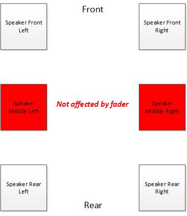
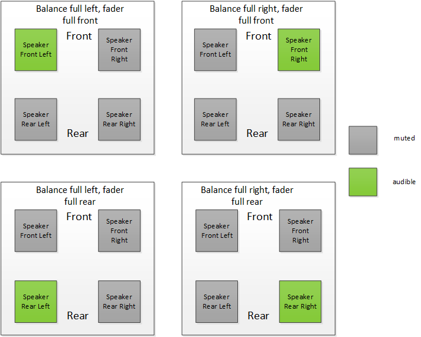
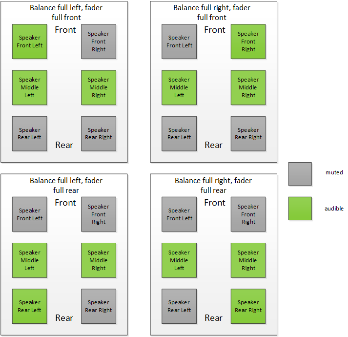
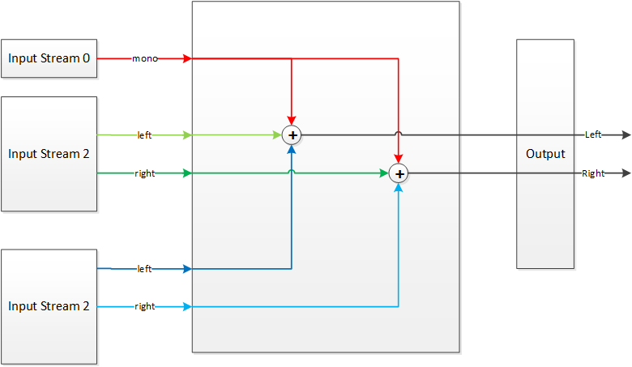
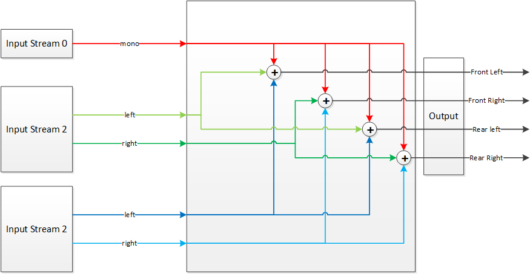
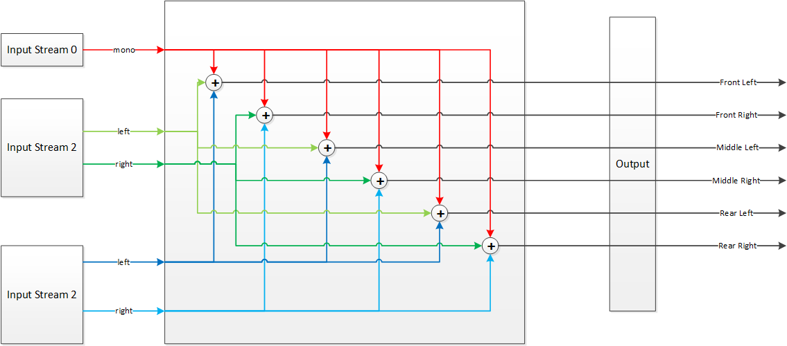

Mixer
=====
@page md_datasheet_mixer

The mixer module is responsible for fading-in and for fading-out the individual sources, and for summing up the individual audio channels. Furthermore, the mixer implements the functions “balance” (left/right) and “fader” (front/rear). Therefore, the mixer is also responsible for mapping the individual sources to the loudspeaker channels, for example, front-left, front-right, rear-left, rear-right, center, low-frequency-effects. Another feature that the mixer provides is a sink-dependent gain offset for all input channels. The gain may be reconfigured at run time.

Internally, the module implements a smooth transition from the current gain factor to the target gain factor to guarantee the absence of any click or plop artifacts that may result from a sudden change of the gain.

###############################
@section ds_mixer_general_info General Information

<table class="doxtable">
<tr><th align=left> Type name <td> "ias.mixer"
<tr><th align=left> Pin configuration         <td> IasAudio::IasISetup::addAudioPinMapping
<tr><th align=left> Default module state      <td> on
<tr><th align=left> Default input gain offset <td> 0 dB
<tr><th align=left> Default balance           <td> 0 dB
<tr><th align=left> Default fader             <td> 0 dB
</table>

The pin configuration for this module is done via the method IasAudio::IasISetup::addAudioPinMapping, which means
this module does out-of-place processing. There is no limit in
the number of pin mappings being added to an instance of the mixer module. In general it is most efficient to
add all pin mappings being processed to one single instance of the processing module.

#######################
@subsection ds_mixer_internal_structure Internal Structure

Internally the mixer is divided into so called elementary mixers, which are responsible for the mapping of several input pins to one output pin.

In the elementary mixer, the data of the input pins is added and copied to the memory of the output pin. This is done depending on the number of channels of the input pin and the number of channels of the output pin.

The elementary mixer can handle input pins with 1, 2 or 6 channels. Others are not supported. If an input pin with 6 channels is configured, the elementary mixer is in a special mode for handling multichannel inputs (basically fixed to Dolby 5.1). This special case is not officially supported in and just used for demo purposes, therefore this demo mode will not be explained here.

The output pins support 2, 4 or 6 channels.

##############
@subsubsection ds_mixer_balance Balance

The balance feature is to control the signal level of the left and right speaker channels. Depending on the parameters, the left or the right side is attenuated while the other is untouched. Detailed explanation of the allowed parameters are given in @ref ds_mixer_control.

@par Balance for 2, 4 or 6 Channels

There is no difference between the channel numbers for balance. All channels from one side are equally affected by balance.

##############
@subsubsection ds_mixer_fader Fader

Fader is similar to balance, but here the rear and front speakers are affected. Detailed explanation of the allowed parameters are given in @ref ds_mixer_control.

@par Fader for 2 Channel Output

If the elementary mixer has only a two channel output stream, no fading is applied at all.

@par Fader for 4 Channel Output

For a 4 channel output, all of the channels are affected by fader.

@par Fader for 6 Channel Output

For a 6 channel output, the picture shows the affected channels:

##############
@subsubsection ds_mixer_input_gain_offset Input Gain Offset

This feature is to add a gain offset to a certain input pin in order to adapt it in level to other streams. Detailed explanation of the allowed parameters are given in @ref ds_mixer_control.

##############
@subsubsection ds_mixer_bal_fad_ext Balance/Fader Extreme Settings

The possible extreme settings for balance and fader are shown in the following figures:

@par 4 Channel Output

@par 6 Channel Output

##############
@subsubsection ds_mixer_mixing_of_outputs Mixing of the Input to the Output Channels

@par 2 Output Channels

@par 4 Output Channels

@par 6 Output Channels

###############################
@section ds_mixer_configuration Configuration Properties

Besides the pin mapping done via the method IasAudio::IasISetup::addAudioPinMapping, there are no other configuration properties available.

###############################
@section ds_mixer_control Runtime Processing Control Properties

The following table describes all commands that can be received by an instance of the mixer
module via the method IasAudio::IasIProcessing::sendCmd. They are typically used during runtime to control
the processing:

<table class="doxtable">
<tr><th> Command <th> Key <th> Value type <th> Value range <th> Description
<tr><td rowspan=2> Set module state <td> "cmd"            <td> int32_t  <td> IasAudio::IasMixer::eIasSetModuleState  <td> Set the module state, i.e. turn the module on or off.
<tr>                                <td> "moduleState"    <td> std::string <td> "on", "off"                             <td> "on" to turn the module on, or "off" to turn it off.
<tr><td rowspan=3> Set input gain offset <td> "cmd"       <td> int32_t  <td> IasAudio::IasMixer::eIasSetInputGainOffset <td> Set a new input gain offset for a specific pin.
<tr>                                <td> "pin"            <td> std::string <td> Valid pin name                          <td> A valid input pin name for which the input gain offset shall be changed.
<tr>                                <td> "gain"           <td> int32_t  <td> -200 to 200                             <td> The new gain offset in 1/10th dB.
<tr><td rowspan=3> Set balance      <td> "cmd"            <td> int32_t  <td> IasAudio::IasMixer::eIasSetBalance      <td> Set a new balance value for a specific input pin. This function is applied to an input pin and controls the gain of the left and right speaker channels. A value > 0 [dB/10] will attenuate the left speaker channels to that it seems that the signal comes more from the right side. A value >= 1440 [dB/10] will mute the left side. A value < 0 [dB/10] will attenuate the right speaker channels so that it seems that the signal comes more from the left. A value <= -1440 [dB/10] will mute the right side. A value of 0 [dB/10] will center the signal again.
<tr>                                <td> "pin"            <td> std::string <td> Valid pin name                          <td> A valid input pin name for which the balance value shall be changed.
<tr>                                <td> "balance"        <td> int32_t  <td> -1440 to 1440                           <td> The new balance value in 1/10th dB. Values > 1440 or values < -1440 are allowed, but will have no additional effect.
<tr><td rowspan=3> Set fader        <td> "cmd"            <td> int32_t  <td> IasAudio::IasMixer::eIasSetFader        <td> Set a new fader value for a specific input pin. This function is applied to an input pin and controls the gain of the rear and front speaker channels. A value > 0 [dB/10] will attenuate the rear speaker channels so that it seems that the signal comes more from the front. A value >= 1440 [dB/10] will mute the rear. A value < 0 [dB/10] will attenuate the front speaker channels to that it seems that the signal comes more from the rear. A value >= -1440 [dB/10] will mute the front. A value of 0 [dB/10] will center the signal again.
<tr>                                <td> "pin"            <td> std::string <td> Valid pin name                          <td> A valid input pin name for which the fader value shall be changed.
<tr>                                <td> "balance"        <td> int32_t  <td> -1440 to 1440                           <td> The new fader value in 1/10th dB. Values > 1440 or values < -1440 are allowed, but will have no additional effect.
</table>

###############################
@section ds_mixer_return Runtime Processing Return Properties

The following table describes all return properties that can be received from an instance of the mixer
module when the IasAudio::IasIProcessing::sendCmd method is called.

<table class="doxtable">
<tr><th> Response for command <th> Key           <th> Value type  <th> Value range <th> Description
<tr><td> Set module state     <td> "moduleState" <td> std::string <td> "on", "off" <td> Property that is returned by the "set module state" command. Provides information whether the module is on or off.
</table>

###############################
@section ds_mixer_events Event Types

The following table describes all event types that can be generated by the mixer module.

<table class="doxtable">
<tr><th> Event type <th> Key <th> Value type <th> Value range <th> Description
<tr><td rowspan=5> Balance finished                 <td> "typeName"        <td> std::string  <td> "ias.mixer"                                     <td> Module type name
<tr>                                                <td> "instanceName"    <td> std::string  <td> Valid instance name                             <td> Instance name
<tr>                                                <td> "eventType"       <td> int32_t   <td> IasAudio::IasMixer::eIasBalanceFinished         <td> Indicates that mixer balance has been finished
<tr>                                                <td> "pin"             <td> std::string  <td> Valid pin name                                  <td> Name of the pin whose balance ramping has been finished
<tr>                                                <td> "balance"         <td> int32_t   <td> -1440 to 1440                                   <td> The new balance value [dB/10]
<tr><td rowspan=5> Fader finished                   <td> "typeName"        <td> std::string  <td> "ias.mixer"                                     <td> Module type name
<tr>                                                <td> "instanceName"    <td> std::string  <td> Valid instance name                             <td> Instance name
<tr>                                                <td> "eventType"       <td> int32_t   <td> IasAudio::IasMixer::eIasFaderFinished           <td> Indicates that mixer fader has been finished
<tr>                                                <td> "pin"             <td> std::string  <td> Valid pin name                                  <td> Name of the pin whose fader ramping has been finished
<tr>                                                <td> "fader"           <td> int32_t   <td> -1440 to 1440                                   <td> The new fader value [dB/10]
<tr><td rowspan=5> Input gain offset finished       <td> "typeName"        <td> std::string  <td> "ias.mixer"                                     <td> Module type name
<tr>                                                <td> "instanceName"    <td> std::string  <td> Valid instance name                             <td> Instance name
<tr>                                                <td> "eventType"       <td> int32_t   <td> IasAudio::IasMixer::eIasInputGainOffsetFinished <td> Indicates that input gain offset has been finished
<tr>                                                <td> "pin"             <td> std::string  <td> Valid pin name                                  <td> Name of the pin whose input gain offset has been finished
<tr>                                                <td> "gainOffset"      <td> int32_t   <td> -200 to 200                                     <td> The new input gain offset [dB/10]
</table>
