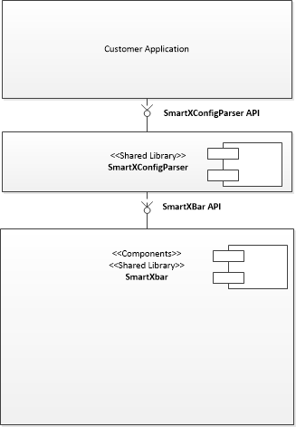

SmartXConfigParser
==================
@page md_datasheet_smartXConfigParser

The SmartXConfigParser is a SmartXbar plug-in library. The library provides an API to automatically setup SmartXbar based on the XML configuration. The XML contains the SmartXbar configuration setup and is generated via the FDK tool. The FDK is a graphical tool that allows the customers to make audio configuration with great ease. 
The library provides a simple interface for the customers to load their XML SmartXbar configuration. The SmartXConfigParser internally uses the SmartXbar official API to setup the devices based on the configuration. The SmartXConfigParser itself uses LibXML2; an XML parser open source library written in C.

The SmartXConfigParser parses sink devices listed under <b>"Sinks"</b> tag, their respective routing zones available under <b>"RoutingZones"</b>, it then links the routing zones to their sink device via 
<b>"SetupLinks"</b> tag and lastly parses the source devices listed under <b>"Sources"</b> in that order. It then starts all the devices available in the XML file and parses the source to sink device mapping, all mentioned under <b>"RoutingLinks"</b> tag. The SmartXConfigParser also allows the user to load multiple SmartXbar XML configurations. Using this feature, customers can load time critical setup early in the application and can later load more SmartXbar XML configuration that are not time critical.

<b>General Recommendation:</b>
- It's not recommended to modify the XML file manually as it may introduce errors in the SmartXbar XML file. The FDK takes care of SmartXbar rules to endure valid configuration to generate the XML file.
- Don't call the API function to parse same SmartXbar setup and XML file twice. This will result in errors as the devices will already exist.
