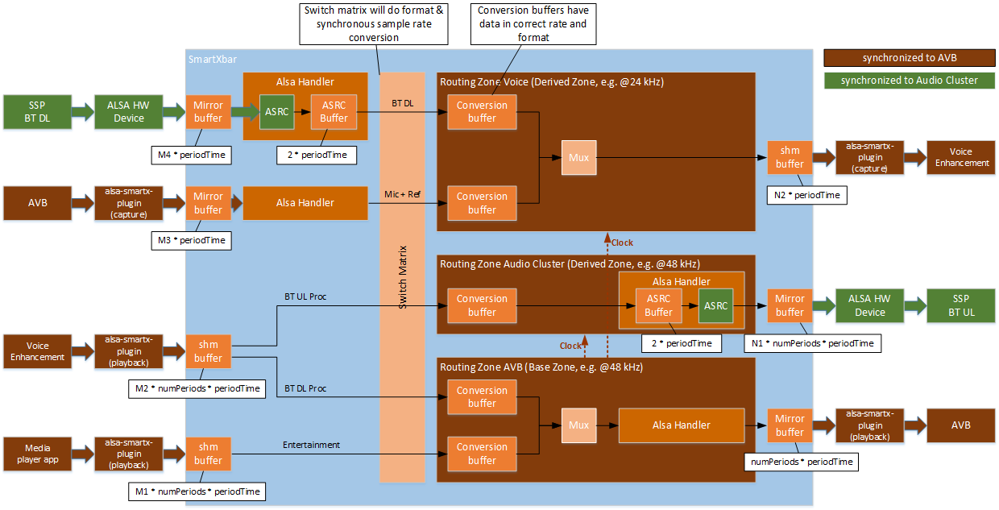
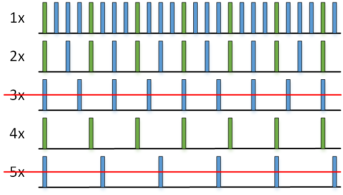

Latency of the SmartXbar
========================
@page md_latency

###############################
@section latency_example Example Configuration

To determine the latencies of the various routing paths through the
SmartXbar, we consider the configuration shown in the following
figure.

The sizes printed in this figure next to the buffers are the latencies introduced
by them. The actual buffer sizes might be bigger like e.g. for the
[ASRC buffer](@ref latency_alsahandlerasrc) or
the [buffers of capture devices](@ref latency_audiodevices). The multipliers
*Mx* and *Ny* are possible variations
of the smallest latency defined by the base routing zone. Allowed are values >= 1.

This example configuration includes the following sources:

* The AVB source, which is implemented by the alsa-avb-plugin. The
alsa-avb-plugin offers an ALSA capture device, which is accessed by
the SmartXbar via the ALSA handler. Since the processing of the
SmartXbar shall be synchronous to the AVB clock domain, the ALSA
handler for the AVB source operates in synchronous mode (without
applying an asynchronous sample rate converter).

* The BT downlink signal, which is received via an SSP port that is
connected to the Audio Cluster. The Audio Cluster implements an ALSA
HW capture device, which is accessed by the SmartXbar via the
ALSA handler. The ALSA hander includes an asynchronous sample rate
converter (ASRC), since the Audio Cluster ALSA device is asynchronous
to the clock domain of the SmartXbar.

* The Voice Enhancement source, which provides the processed voice
signals (BT UL Proc and BT DL Proc). The SmartXbar applies the
alsa-smartx-plugin to implement the ALSA playback device, which is
used by the Voice Enhancement application. No ASRC is applied.

* The Media Player source, which also uses an ALSA playback device that
is provided by the alsa-smartx-plugin. No ASRC is applied.

The example configuration includes the following sinks:

* The AVB sink, which is implemented by the alsa-avb-plugin. The
alsa-avb-plugin offers an ALSA playback device, which is accessed by
the SmartXbar via the ALSA handler. The AVB sink represents the
clock source for the complete SmartXbar. For this reason, the
routing zone AVB is configured as the base routing zone. All other
sinks are serviced by derived routing zones, which receive their
trigger pulse from the base routing zone. Since the AVB sink
represents the clock source, there is no ASRC within the signal path.

* The BT uplink signal, which is transmitted via an SSP port that is
connected to the Audio Cluster. The Audio Cluster implements an ALSA
HW playback device, which is accessed by the SmartXbar via the
ALSA handler. The ALSA hander includes an asynchronous sample rate
converter (ASRC), since the ALSA device is asynchronous to the clock
domain of the SmartXbar. The associated routing zone (Routing
Zone Audio Cluster) is configured as a derived zone, since it is
triggered by the base zone (routing zone AVB).

* The Voice Enhancement sink, which processes the BT DL signal, the
microphone signal, and the reference signal. The SmartXbar applies the
alsa-smartx-plugin to implement the ALSA capture device, which is used
by the Voice Enhancement application. No ASRC is applied. The
associated routing zone (routing zone Voice) is configured as a
derived zone, since it is triggered by the base zone (routing zone
AVB).

###############################
@section latency_audiodevices Audio Devices

The configuration of audio devices (source devices and sink devices)
is based on the device parameters IasAudio::IasAudioDeviceParams. In
particular, the parameters *periodSize* and *numPeriods* influence the
latency of the audio device:

* *periodSize* defines how many PCM frames build one block of audio that
is processed at a time,

* *numPeriods* defines how many blocks of audio can be buffered by the
audio device.

In case of an ALSA playback device, the device starts playing as soon
as the device buffer is filled completely. This results in a latency
of *periodSize * numPeriods* PCM frames. By configuring more than one
period (*numPeriods* > 1), we can reduce the risk that an ALSA
playback device has a buffer underrun even if the execution of the
application that writes into the ALSA device is stalled for a short
time. For being able to compensate scheduling glitches when writing to the
playback devices linked to derived zones, the device buffer
of those devices is only filled up to *periodSize * (numPeriods-1)*.
This reduces the latency for this devices by one period.

In case of an ALSA capture device, the device starts streaming PCM
frames to the application as soon as the hardware device (or the
plugin) has provided the first period of PCM frames. This results in a
latency of *periodSize* PCM frames. Therefore, by configuring more
than one period (*numPeriods* > 1), we do not increase the latency of
the capture device, but we can reduce the risk that the ALSA capture
device has a buffer overflow even if the execution of the application
that reads from the ALSA device is stalled for a short time.

###############################
@section latency_audiosinkdevices Audio Sink Devices

Audio sink devices can be either ALSA playback devices, if they are
implemented by a hardware device or by the alsa-avb-plugin, or ALSA
capture devices, if they are implemented by the alsa-smartx-plugin. As
described in Section @ref latency_audiodevices, the latency of the
audio sink device includes the factor *numPeriods*, if the audio sink
device represents an ALSA playback device (as in case of the AVB
sink). For sink devices representing an ALSA capture device, the
factor *numPeriods* does not occur (as in case of the Voice
Enhancement sink).

If a sink device is connected to a derived routing zone that applies a
longer period time (e.g., *N1 * periodTime* in case of the routing zone
Audio Cluster), the latency of the sink device is increased
accordingly (e.g., *N1 * periodSize * numPeriods - periodSize* PCM frames in case of
the BT sink device). The latency is one period less because of not filling
the device buffer completely. See chapter @ref latency_audiodevices for details.

###############################
@section latency_audiosourcedevices Audio Source Devices

Audio source devices can be either ALSA capture devices, if they are
implemented by a hardware device or by the alsa-avb-plugin, or ALSA
playback devices, if they are implemented by the
alsa-smartx-plugin. As described in Section @ref
latency_audiodevices, the latency of the audio source device includes
the factor *numPeriods*, if the audio source device represents an ALSA
playback device (as in case of the media player source). For source
devices representing an ALSA capture device, the factor *numPeriods*
does not occur (as in case of the AVB source).

###############################
@section latency_alsahandlerasrc ALSA Handler with Asynchronous Sample Rate Converter

The ALSA handler needs to be configured in asynchronous mode, if it
shall read from (or write to) an ALSA device that is triggered by a
clock that is independent to the clock of the SmartXbar. To
compensate for the drift between the two clock domains, the ALSA
handler applies an asynchronous sample rate converter (ASRC) and an
ASRC buffer.

The ASRC buffer operates as a ring buffer, and its fill level is used
to adapt the conversion ratio used by the ASRC. The target of the ASRC
is to control the conversion ratio in such a way that the ASRC buffer
has a fill level of 50% in the mean. As a consequence, the ASRC buffer
results in a latency of 0.5 * *asrcBufferSize* PCM frames, where
*asrcBufferSize* represents the (configurable) length of the ASRC
buffer. The recommended and default *asrcBufferSize* is *4 * periodTime*, which
results in a latency for the ASRC buffer of *2 * periodTime*.

###############################
@section latency_overalllatency Overall Latency

The latency that results from the routing through the SmartXbar
is equal to the sum of the following latencies:

- latency of the audio source device, see Section @ref latency_audiosourcedevices
- (optional) latency of the ASRC buffer within the ALSA Capture Handler,
  if the audio source is asynchronous to the SmartXbar,
  see Section @ref latency_alsahandlerasrc
- (optional) latency of the ASRC buffer within the ALSA Playback Handler,
  if the audio sink is asynchronous to the SmartXbar,
  see Section @ref latency_alsahandlerasrc
- latency of the audio sink device, see Section @ref latency_audiosinkdevices

Here are some examples describing the latencies when choosing different signal path
through the SmartXbar according to the configuration shown in the figure above:

###################
@subsection latency_ex_sources Example of Latencies for Audio Source Devices

##########
@subsubsection media_player_app Media Player App

<table class="doxtable">
<tr><th> Example # <th> Multiplier <th> numPeriods <th> periodTime (ms) <th> Total latency (ms)
<tr><td> 1         <td> 1          <td> 3          <td> 4               <td> 12
<tr><td> 2         <td> 1          <td> 4          <td> 4               <td> 16
<tr><td> 3         <td> 2          <td> 3          <td> 4               <td> 24
</table>

##########
@subsubsection ssp_bt_dl SSP Bluetooth Downlink including ASRC

<table class="doxtable">
<tr><th> Example # <th> Multiplier <th> periodTime (ms) <th> ASRC buffer (ms) <th> Total latency (ms)
<tr><td> 1         <td> 1          <td> 4               <td> 2*4              <td> 12
<tr><td> 2         <td> 2          <td> 4               <td> 2*4              <td> 16
</table>

###################
@subsection latency_ex_sinks Example of Latencies for Audio Sink Devices

##########
@subsubsection avb_sink AVB Sink Linked to Routing Zone AVB

<table class="doxtable">
<tr><th> Example # <th> numPeriods <th> periodTime (ms) <th> Total latency (ms)
<tr><td> 1         <td> 3          <td> 4               <td> 12
<tr><td> 2         <td> 4          <td> 4               <td> 16
</table>

##########
@subsubsection ssp_bt_ul SSP Bluetooth Uplink including ASRC

<table class="doxtable">
<tr><th> Example # <th> Multiplier <th> numPeriods <th> periodTime (ms) <th> ASRC buffer (ms) <th> Total latency (ms)
<tr><td> 1         <td> 1          <td> 3          <td> 4               <td> 2*4              <td> 20
<tr><td> 2         <td> 1          <td> 4          <td> 4               <td> 2*4              <td> 24
<tr><td> 3         <td> 2          <td> 3          <td> 4               <td> 2*4              <td> 32
</table>

###################
@subsection latency_ex_total Examples of Total Latency from Audio Source Device through SmartXbar to Audio Sink Device

The following table shows examples for all possible connections of audio source devices with audio sink devices.
The latencies used are just examples and depend on the selection of the *periodTime* and the *numPeriods*.
For this table the *periodTime* was set to 4 ms and the *numPeriods* was set to 3.

<table class="doxtable">
<tr><th>                     <th colspan=4> Latency (ms)
<tr><th> Type                <th> Example #1 <th> Example #2 <th> Example #3 <th> Example #4
<tr><td> Audio source device <td> 12 <td> 12 <td> 12 <td> 12
<tr><td> ASRC Source Device  <td> -  <td> 8  <td> -  <td> 8
<tr><td> ASRC Sink Device    <td> -  <td> -  <td> 8  <td> 8
<tr><td> Audio sink device   <td> 12 <td> 12 <td> 12 <td> 12
<tr><td colspan=5>
<tr><th> Total latency (ms)  <td> 24 <td> 32 <td> 32 <td> 40
</table>

###############################
@section latency_constant_latency Configuring the System for Constant Latency

In many cases it is desired to have a well defined constant latency for the same use-case for each system startup.
Therefor the SmartXbar synchronizes several actions when setting up a routing path, e.g.

- the connects from a source port to a sink port,
- the start of the derived routing zones,
- the buffer fill levels of the sink devices linked to a derived zone

For being able to do that, the configuration of the period times for the base zone and
their derived zone(s) has to obey a rule. All synchronous zones,
i.e. the base zone and all their derived routing zones,
have to have period times that are integral multiple when comparing them to each other. This is not only true
when comparing the period time of the base zone with the period time of all of their derived zones, but also when
comparing the period times of two different derived zones with each other (of the same base zone). Valid period time
multipliers could be 1 for the base zone, and 2, 4, 8 for the derived zones. Another example would be to have
1 for the base zone and 3, 6 for the derived zones.

Following this rule is required to have a point in time, where all sink devices can be triggered at the same time.
The following image shall help to understand the common trigger point:

The rectangles are points in time, when a sink device can be serviced. The green rectangles mark the common
trigger point of all sink devices. For period times 1, 2 and 4, the common trigger point is every 4th base
period time. However, when looking at period times 3 and 5, you can see there is only one common point,
which is the first one, but then it takes a long time until you would find a next point, where all 5
period times are serviced the same time. But this common point is required by the SmartXbar to synchronize all
above mentioned actions. Applying the simple rule above, helps to keep the time it takes to hit the next
synchronization point minimal.

@note As the synchronization point depends on the longest period time configured, it can take maximal up to
this time until one of the actions above are actually applied.
