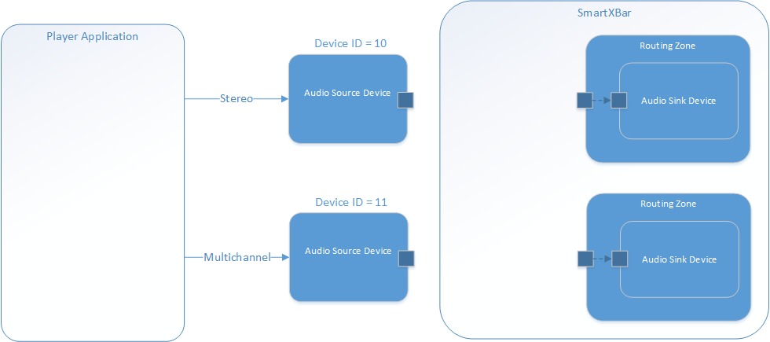
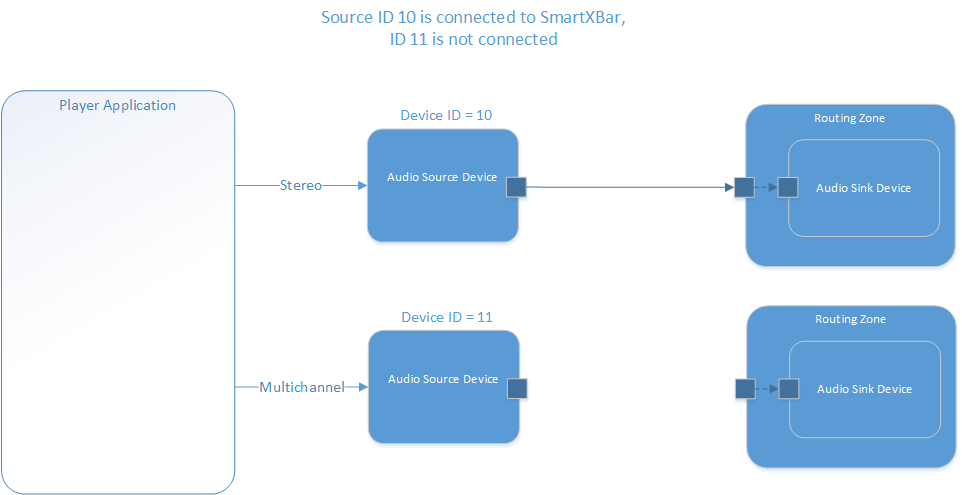
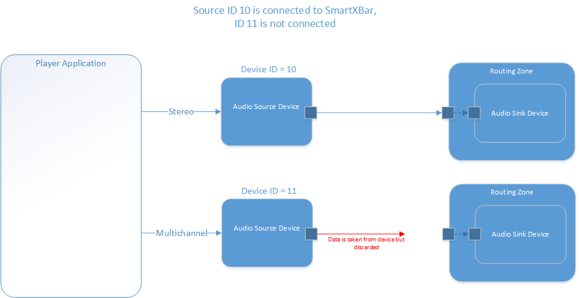
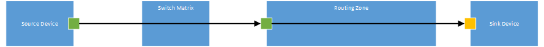

Special features
================
@page md_special_features

###############################
@section source_groups Source Groups

A typical audio player application might provide the same content in different channel formats (e.g. stereo downmix and multichannel) at the same time while playing.
For each channel format the player streams to a separate audio device, see picture below.

Each of the audio devices is configured for the SmartXBar to have its own ID and can be connected to the SmartXbar individually.

The standard behaviour is, that when only one of the two devices is connected, then the not connected one will block and the player will not be able to stream the data to it.
The usecase is shown in the picture below:

In this example, the device with ID 10 is connected, the one with ID 11 not. This will result in a blocking of the multichannel device.
In this scenario it is not possible to switch seamlessly between multichannel and stereo. In order to do so, the data from the not connected
device must also be received and discarded by the SmartXBar. This will prevent blocking of the device.

To allow seamless switching between the devices, the SmartXBar can be configured to have source groups, which belong together and have the same content. In our example device ID 10 and 11
could be configured to be a source group with a unique name.
When one device of a source group is connected and the others not, then the SmartXBar will also read the data from the other devices and discard them, just to prevent
the blocking of the device.

If now the connection of the stereo device is removed, then the SmartXBar will stop to take out data from all other grouped devices.

###############################################
@section probing Data Probing

SmartXbar is able to do data probing on specific audio ports or audio pins. For one port or pin, either a data recording or injecting can be done.

  - Recording: The data, that is routed via this port/pin, will be recorded to wave files, that will be stored under /tmp. For each channel of the
               port/pin there will be one wave file created, so e.g. recording at a stereo port/pin will create two mono wave files under /tmp.

  - Injecting: The data, that is routed via this port/pin will be overwritten by data coming from wave files located under /tmp. For each channel
               of the port/pin there must be one mono wave file under /tmp.

Probing for audio pins is a bit special. It is only possible to do probing for pins which are added to a processing module.We have three different types of pins:
  - Input pins         -> probing is done just before the processing function of the module
  - Output pins        -> probing is done just after the processing function of the module
  - InputOutput pins   -> for recording, the probing is done before and after the processing function, so two wave files are created for recording
                       -> for injecting, the probing is done before the processing function only ( data format is tightened to Float32, so wav file needs to be in correct format

File names: The names of the wave files consist of the following:
  - prefix: free to chose any prefix, defined by the API call when probing is started.
  - channel appendix: every wave file will have an appendix like _chX , where the X is the channel number.
The following picture shows a possible scenario:

The small squares (green and yellow) are the audio ports that where defined during setup. When probing is done for a green audio port, the probing will happen within the switch matrix. Probing for the yellow ports will happen within routing zone.

There are two functions to start a probing:

IasAudio::IasIDebug::startInject

IasAudio::IasIDebug::startRecord

##############
@subsection start_inject Start Injecting

The code snippet shows the parameters for the function.

~~~~~~~~~~{.cpp}
 virtual IasResult startInject(const std::string &fileNamePrefix, const std::string &name, uint32_t numSeconds)=0;
 ~~~~~~~~~~

The software expects several wave files ( according to the number of channels in the port ), all starting with fileNamePrefix and having the appendix \_chX.wav ( where X is the channel number). E.g. injecting for a stereo port with a file name prefix "test" implies that under /tmp there are two files, test_ch0.wav and test_ch1.wav .

##############
@subsection start_record Start Recording

The code snippet shows the parameters for the function.

~~~~~~~~~~{.cpp}
 virtual IasResult startRecord(const std::string &fileNamePrefix, const std::string &portName, uint32_t numSeconds)=0;
 ~~~~~~~~~~
* If probing is for a port, the software will create several wave files ( according to the number of channels in the port ), all starting with fileNamePrefix and having the appendix \_chX.wav ( where X is the channel number). E.g. recording for a stereo port with a file name prefix "test" will generate two files in /tmp, test_ch0.wav and test_ch1.wav
* If probing is for a pin, the software will create several wave files ( according to the number of channels in the pin ), depending on the type of the pin.
    * InputOutput Pin: a wave file for every channel at the input side and the output side of the pin ( e.g. a stereo input/output pin will generate two mono files for input side and two mono files for output side)
    * Input Pin: a wave file for every channel at the input side of the pin
    * Output Pin: a wave file for every channel at the output side of the pin

If the pin is called e.g. "MyPin" and the prefix was chosen to be "test", the generated files will be:

|Prefix   | Pin Type | Wave files |
|---|----------------|-------------------|
|test | InputOutput | test_MyPin_input_chX.wav , test_MyPin_output_chX.wav|
|test | Input | test_MyPin_input_chX.wav |
|test | Output | test_MyPin_output_chX.wav |

##############
@subsection stop_probing Stop Probing

The probing will stop automatically if the desired amount of data is injected or captured ( defined with parameter numSeconds ). To manually stop it before the regular ending, the function IasAudio::IasIDebug::stopProbing can be used

~~~~~~~~~~{.cpp}
virtual IasResult stopProbing(const std::string &portName)=0;
~~~~~~~~~~

