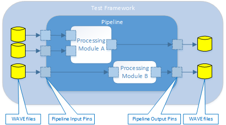

Testing Processing Modules using the SmartX Test Framework
==========================================================
@page md_testing_processing_modules

The SmartXbar provides a test framework that can be used to verify the
implementation of custom processing modules. The test framework
applies the same API for interfacing a processing module as used by
the SmartXbar. Therefore, every processing module that can be plugged
into the SmartXbar can be also executed by the test framework. In
contrast to the SmartXbar, the test framework does not use ALSA
devices for the sources and sinks. Instead, WAVE files are used

* for providing the content that shall be played by a source
* for recording the content that is received by a sink.

Therefore, the SmartX test framework offers the infrastructure to
verify the implementation of a custom processing module, e.g., by
means of bit exactness tests. The following figure shows an example
configuration of the test framework, which evaluates a pipeline
consisting of two processing modules.

################################################
@section testfwx_general_procedure General Procedure when Using the SmartX Test Framework

The general procedure for writing test applications using the SmartX
test framework includes the following steps:

-# Create the SmartX test framework instance
-# Create and add processing modules to the test framework pipeline and
link them as desired
-# Link the test framework pipeline input and output with corresponding
input and output WAVE files
-# Start the test framework
-# Execute processing pipeline (frame by frame), send commands to modules
if necessary, and evaluate output signals
-# Stop and destroy the test framework instance

################################################
@section testfwx_starting_point Starting Point for Using the SmartX Test Framework

The starting point for using the SmartX test framework is via the header
file IasTestFramework.hpp. This header is used to instantiate and
setup the test framework, it also provides interfaces for executing
processing pipeline and for controlling processing modules.
We can instantiate the test framework using IasTestFramework::create
function. With this function we create a SmartX pipeline inside the
test framework and set up pipeline parameters such as name, sample rate
and period size. These parameters will be used later during processing
of input WAVE files. It is possible to create only one instance of the
test framework at a time.

~~~~~~~~~~{.cpp}
#include "audio/testfwx/IasTestFramework.hpp"

IasAudio::IasPipelineParams pipelineParams;
pipelineParams.name       = "TestFrameworkPipeline";
pipelineParams.periodSize = 64;
pipelineParams.samplerate = 48000;

IasAudio::IasTestFramework *testfwx = IasAudio::IasTestFramework::create(pipelineParams);

// Start using the test framework from that point on via the single instance pointer testfwx
// ...
~~~~~~~~~~

To clean-up and free the resources on test application shutdown we
should destroy the test framework instance using the following method:

~~~~~~~~~~{.cpp}
IasAudio::IasTestFramework::destroy(testfwx);
~~~~~~~~~~

################################################
@section testfwx_setup Test Framework Setup Interface

Test framework setup interface is used to define the topology of the
processing pipeline which was created automatically inside the test
framework when IasTestFramework::create method was called. It is
not possible to obtain a handle to the pipeline. The whole set up
should be done via the setup interface whose handle can be obtained
with the following method:

~~~~~~~~~~{.cpp}
IasAudio::IasTestFrameworkSetup *setup = testfwx->setup();
~~~~~~~~~~

The test framework setup interface provides methods:

* for creating processing modules and adding them to the pipeline
* for setting processing modules properties
* for creating audio pins and adding them to the pipeline or to
processing modules
* for creating links via audio pins i.e. between processing modules,
between pipeline input/output and WAVE files, between pipeline
input/output and processing modules.

For detailed description of the available methods please refer to
the IasTestFrameworkSetup.hpp header.

##############
@subsection testfwx_pipeline_input_and_output Defining Pipeline Input and Output

To provide audio content to the processing pipeline input we need
to provide input WAVE files and link them with the pipeline input
pins. Audio content from the pipeline output will be recorded to the
output WAVE files that should be linked with the pipeline output pins.
As an example, we create audio input and output pins:

~~~~~~~~~~{.cpp}
IasAudio::IasAudioPinPtr pipelineInputPin = nullptr;
IasAudio::IasAudioPinParams pipelineInputParams;
pipelineInputParams.name = "pipelineInput";
pipelineInputParams.numChannels = 2;
result = setup->createAudioPin(pipelineInputParams, &pipelineInputPin);

IasAudio::IasAudioPinPtr pipelineOutputPin = nullptr;
IasAudio::IasAudioPinParams pipelineOutputParams;
pipelineOutputParams.name = "pipelineOutput";
pipelineOutputParams.numChannels = 2;
result = setup->createAudioPin(pipelineOutputParams, &pipelineOutputPin);
~~~~~~~~~~

Then we add audio input and output pins to the pipeline:

~~~~~~~~~~{.cpp}
result = setup->addAudioInputPin(pipelineInputPin);
result = setup->addAudioOutputPin(pipelineOutputPin);
~~~~~~~~~~

It is important to add audio pins to the pipeline before linking them
with WAVE files because all audio pins, after creating, are of the same,
generic type. WAVE files can be linked only with pipeline input pins
or pipeline output pins. In other case the setup interface will return
IasAudio::IasTestFrameworkSetup::eIasFailed error code.

We link WAVE files with audio pins in a following way:

~~~~~~~~~~{.cpp}
IasAudio::IasTestFrameworkWaveFileParams inputFileParams;
inputFileParams.fileName = "inputFile.wav";
result = setup->linkWaveFile(pipelineInputPin, inputFileParams);

IasAudio::IasTestFrameworkWaveFileParams outputFileParams;
inputFileParams.fileName = "outputFile.wav";
result = setup->linkWaveFile(pipelineOutputPin, outputFileParams);
~~~~~~~~~~

It is possible to link several pipeline input pins with the same WAVE
file, but for each pipeline output pin we need to provide separate
WAVE files. Each pipeline input pin must provide the same number of
channels as its corresponding WAVE file, otherwise the setup interface
will return IasAudio::IasTestFrameworkSetup::eIasFailed error code.
When the sample rate that is specified in the WAVE file header and the
sample rate of the pipeline do not match, the setup interface will return
IasAudio::IasTestFrameworkSetup::eIasOk error code, which indicates
success, but a DLT warning will be generated and WAVE file content will
be processed with the sample rate from the pipeline.
Each output WAVE file will be created with the number of channels which
is defined for its corresponding output pin, and the sample rate from
the pipeline will be applied.

##############
@subsection testfwx_processing_modules Creating, Configuring and Initializing a Processing Module

Processing modules should be linked into a shared library
(see Section @ref deployment for details),
which is loaded when the pipeline is being created inside the
IasTestFramework::create method call. In order to use a particular processing
module in the test framework we need to create its instance, set its
properties and add it to the pipeline.
As an example we create an instance of the volume/loudness module:

~~~~~~~~~~{.cpp}
IasAudio::IasProcessingModulePtr volumeModule = nullptr;
IasAudio::IasProcessingModuleParams moduleParams;
moduleParams.typeName = "ias.volume";
moduleParams.instanceName = "MyVolume";
result = setup->createProcessingModule(moduleParams, &volumeModule);
~~~~~~~~~~

After the module instance was successfully created we have to configure
its properties. Details about the configuration can be found in the
accompanying [datasheet of the processing module](@ref ds_vl_configuration).
In this case we are only setting the mandatory parameter:

~~~~~~~~~~{.cpp}
IasAudio::IasProperties volumeProperties;
volumeProperties.set<int32_t>("numFilterBands", 3);
setup->setProperties(volumeModule, volumeProperties);
~~~~~~~~~~

Now we have to add the module instance to the pipeline:

~~~~~~~~~~{.cpp}
result = setup->addProcessingModule(volumeModule);
~~~~~~~~~~

After that we need to define the pin configuration. The pin configuration
defines how many input, output or combined input/output pins the module
shall provide (see Section @ref pin_configs for details). The volume/loudness module only supports combined
input/output pins according to the datasheet, so we are creating one
stereo input/output pin:

~~~~~~~~~~{.cpp}
IasAudio::IasAudioPinPtr moduleInOutPin = nullptr;
IasAudio::IasAudioPinParams moduleInOutPinParams;
moduleInOutPinParams.name = "stereo0";
moduleInOutPinParams.numChannels = 2;
result = setup->createAudioPin(moduleInOutPinParams, &moduleInOutPin);
~~~~~~~~~~

and adding it to the processing module:

~~~~~~~~~~{.cpp}
result = setup->addAudioInOutPin(volumeModule, moduleInOutPin);
~~~~~~~~~~

For processing modules that support different pin mappings, such as 1:1,
n:1, 1:m, n:m, the test framework setup interface provides
IasAudio::IasTestFrameworkSetup::addAudioPinMapping method. With this
method it is possible to create all necessary links between input and
output pins of particular processing module.

##############
@subsection testfwx_signal_flow Defining the Signal Flow through the Pipeline

Defining the signal flow through the pipeline is done by linking the
previously created audio pins with each other in the desired sequence.
As an example we link the input pin of the pipeline with the input/output
pin of the volume/loudness module. Then we link the input/output pin
of the volume/loudness module with the output pin of the pipeline:

~~~~~~~~~~{.cpp}
result = setup->link(pipelineInputPin, moduleInOutPin, eIasAudioPinLinkTypeImmediate);
result = setup->link(moduleInOutPin, pipelineOutputPin, eIasAudioPinLinkTypeImmediate);
~~~~~~~~~~

With IasAudio::IasTestFrameworkSetup::link method we can also define the
flow between two processing modules by linking their inputs and outputs
as desired.

################################################
@section testfwx_using_test_framework Using the Test Framework

After the pipeline is configured and setup, we can start using the test
framework to execute and verify the processing modules.

##############
@subsection testfwx_starting_test_framework Starting and Stopping the Test Framework

Before the processing modules can be executed we need to start the test
framework. This has to be done after the pipeline topology has been defined.

~~~~~~~~~~{.cpp}
result = testfwx->start();
~~~~~~~~~~

In this function we execute the pipeline sequencer in order to:

* analyse signal dependencies
* identify the scheduling order of the processing modules
* create required audio streams

In addition we open all input and output WAVE files for reading and
writing. After this method has been called, the test framework is
ready for processing.

After all the processing has been finished, we need to stop the test
framework and close all previously opened WAVE files by calling
the following method:

~~~~~~~~~~{.cpp}
testfwx->stop();
~~~~~~~~~~

##############
@subsection testfwx_executing_processing_modules Executing Processing Modules

After the test framework has been started and all the WAVE files opened
we can start processing. This can be done using
IasAudio::IasTestFramework::process() function:

~~~~~~~~~~{.cpp}
uint32_t numPeriods = 1;
do
{
  result = testfwx->process(numPeriods);
}
while (result == IasAudio::IasTestFramework::eIasOk)
~~~~~~~~~~

In this function we read data from all input WAVE files, execute pipeline
audio chain, and write the result into the output WAVE files. In contrast
to the SmartXbar, we can control the number of periods which are processed
in each iteration. The function processes the number of periods which we
specify as an input parameter, and returns IasAudio::IasTestFramework::eIasOk
error code when required number of periods has been processed successfully.

When we use several WAVE files as pipeline input, their length can vary.
In such case the test framework continues processing until the longest
file comes to its end. For shorter files, when their whole content
has been read and processed, the test framework will use zero-valued samples
for related audio streams. When processing of all input files has been
finished, the function will return IasAudio::IasTestFramework::eIasFinished
error code.

##############
@subsection testfwx_processing_interface Processing Interface

For controlling audio processing modules during runtime the test
framework provides the same processing interface as it is used by SmartXbar.
To obtain a handle to this interface the following method has to be called:

~~~~~~~~~~{.cpp}
IasAudio::IasIProcessing *processing = testfwx->processing();
~~~~~~~~~~

The IasAudio::IasProcessing interface provides IasAudio::IasProcessing::sendCmd
method, which can be used to send commands to processing modules that are being
executed. Commands that are supported by a processing module are defined by the
module itself and are described in the accompanying documentation.

As an example we use the processing interface to set volume for volume/loudness
module. For reference to all commands supported by volume/loudness module please
refer to the [datasheet of the processing module](@ref ds_vl_configuration).

~~~~~~~~~~{.cpp}
IasAudio::IasProperties cmdProperties;
IasAudio::IasProperties returnProperties;

cmdProperties.set("cmd", IasVolume::eIasSetVolume);
cmdProperties.set("volume", -300);
cmdProperties.set("pin", moduleInOutPinParams.name);

processing->sendCmd("MyVolume", cmdProperties, returnProperties);
~~~~~~~~~~

Processing module is identified by its instance name ("MyVolume"), which
was set as a module parameter during module creation. Commands should be
specified using IasAudio::IasProperties class which applies key-value
pairs to define certain properties. In this case we are using
IasVolume::eIasSetVolume command id to identify the command, we are
setting the new volume level to -300 (i.e., -30 dB) and using previously added input/output
pin, for which the new volume will be applied.
Processing module can provide feedback for certain commands. It can
be obtained as the returnProperties output parameter. Its content depends
on the processing module and might be empty. Return properties that are
supported by a processing module are described in the accompanying
documentation.

##############
@subsection testfwx_receiving_events Receiving Events

Processing modules use events in order to signalize state changes in
the processing context. Events are of type IasAudio::IasModuleEvent,
and are put into an event queue. The test framework supports the mechanism
for receiving and evaluating events that is analogous to the one that
is supported by the SmartXbar. Events from the event queue can be consumed
by the test application by using the following method:

~~~~~~~~~~{.cpp}
IasAudio::IasEventPtr newEvent;
result = testfwx->getNextEvent(&newEvent);
if (result == IasAudio::IasTestFramework::eIasOk)
{
  // Event available
  // ...
}
~~~~~~~~~~

This method immediately returns either with the information that there
was an event available, which is IasAudio::IasTestFramework::eIasOk,
or with the information that there is no event available, which is
IasAudio::IasTestFramework::eIasNoEventAvailable. This makes the method
suitable to be used for polling for new events.
There is also the possibility to make a blocking wait call until a new
event is available:

~~~~~~~~~~{.cpp}
result = testfwx->waitForEvent(0);
if (result == IasAudio::IasTestFramework::eIasOk)
{
  // Event available
  result = testfwx->getNextEvent(&newEvent);
}
~~~~~~~~~~

The parameter of the IasAudio::IasTestFramework::waitForEvent method
defines the timeout in msec after which the method returns regardless
whether there is an event in the queue or not.

##############
@subsection testfwx_evaluating_events Evaluating Events

To evaluate the contents of the event we have to derive a class from the
IasAudio::IasEventHandler class and override the methods of the events
we are interested in. This can be done in the same manner as for
SmartXbar applications, therefore please refer to @ref evaluate_module_event
for more detailed description.

##############
@subsection testfwx_example_processing_loop Example Processing Loop

As an example we implement a simple processing loop for the volume/loudness
module to show how the commands and events can be used during runtime.
In this example we assume, that the pipeline topology is already defined.
This means that
* the module instance is created and added to the pipeline,
* all necessary pins are created, added and linked,
* input and output WAVE files are linked with pipeline input and output.

~~~~~~~~~~{.cpp}
// Start the test framework
result = testfwx->start();

uint32_t periodCounter = 0;       // number of periods already processed
uint32_t numPeriodsToProcess = 1; // number of periods to process in one iteration

// Main processing loop
do
{
  IasAudio::IasProperties cmdProperties;     // command properties
  IasAudio::IasProperties returnProperties;  // return properties
  int32_t cmdId;                // command id
  IasInt32Vector rampParams;       // ramp parameters
  rampParams.resize(2);            // ramp parameters vector size must be 2

  // Send commands to processing module
  if ((periodCounter % 8000) == 2000)
  {
    cmdProperties.clearAll();
    // In this case we are going to set new volume level to 0 with exponential ramp shape
    cmdId = IasVolume::eIasSetVolume;
    cmdProperties.set("cmd", cmdId);
    cmdProperties.set("volume", 0);
    rampParams[0] = 2000;
    rampParams[1] = eIasRampShapeExponential;
    cmdProperties.set("ramp", rampParams);
    // Choose pin for which the change should be applied
    cmdProperties.set("pin", moduleInOutPinParams.name);
    // Send command
    processing->sendCmd("MyVolume", cmdProperties, returnProperties);
  }
  else if ((periodCounter % 8000) == 4000)
  {
    cmdProperties.clearAll();
    // In this case are going to turn off loudness
    cmdId = IasVolume::eIasSetLoudness;
    cmdProperties.set("cmd", cmdId);
    cmdProperties.set<std::string>("loudness", "off");
    cmdProperties.set("pin", moduleInOutPinParams.name);
    processing->sendCmd("MyVolume", cmdProperties, returnProperties);
  }
  // Further cases here
  // ...

  // Process given number of periods
  result = testfwx->process(numPeriodsToProcess);

  // Check for events
  while (testfwx->waitForEvent(0) == IasAudio::IasTestFramework::eIasOk)
  {
    // Get event from the queue
    IasAudio::IasEventPtr newEvent;
    result = testfwx->getNextEvent(&newEvent);
    if (result == IasAudio::IasTestFramework::eIasOk)
    {
      // Implementation of event handler
      class : public IasAudio::IasEventHandler
      {
        virtual void receivedConnectionEvent(IasAudio::IasConnectionEvent* event)
        {
          // Connection event received
        }
        virtual void receivedSetupEvent(IasAudio::IasSetupEvent* event)
        {
          // Setup event received
        }
        virtual void receivedModuleEvent(IasAudio::IasModuleEvent* event)
        {
          // Module event received, get event properties here
          const IasAudio::IasProperties eventProperties = event->getProperties();
          std::string typeName = "";
          std::string instanceName = "";
          int32_t eventType;
          eventProperties.get<std::string>("typeName", &typeName);
          eventProperties.get<std::string>("instanceName", &instanceName);
          eventProperties.get<int32_t>("eventType", &eventType);

         // Handling events from ias.volume module
         if (typeName == "ias.volume"))
         {
           std::string pinName;
           IasAudio::IasProperties::IasResult res = eventProperties.get<std::string>("pin", &pinName);
           (void)res;
           switch(eventType)
           {
             case static_cast<int32_t>(IasAudio::IasVolume::eIasVolumeFadingFinished):
               cout << instanceName << ": volume fading finished for pin " << pinName << endl;
               break;
             case static_cast<int32_t>(IasAudio::IasVolume::eIasLoudnessSwitchFinished):
               cout << instanceName << ": loudness switch finished for pin " << pinName << endl;
               break;
             // Remaining event types can be handled here
             // ...
           }
         }
         // Events from further module type names can be processed here
         // ...
        }
      } myEventHandler;

      // Call the dispatch method
      newEvent->accept(myEventHandler);
    }
  }

  periodsCounter++;
}
while ( result == IasTestFramework::eIasOk );

// Stop the test framework
testfwx->stop();
~~~~~~~~~~
