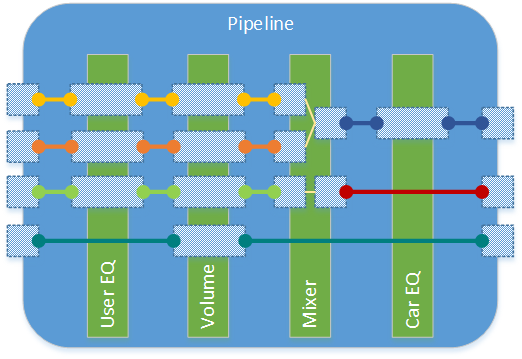
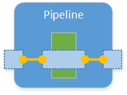
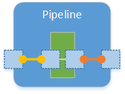
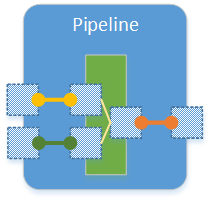
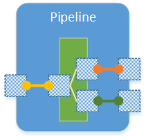
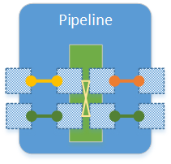
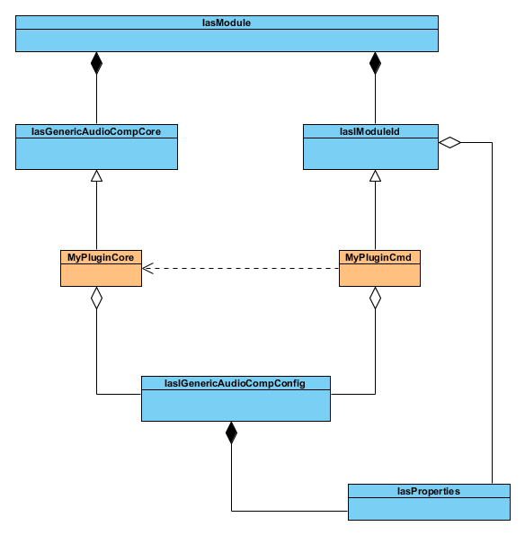

Writing a processing module
===========================
@page md_writing_processing_modules

The SmartXbar processing pipeline has the ability to extend its functionality by the means of custom processing modules.
The following sections will explain how custom processing modules have to be implemented to be integrated into the
SmartXbar processing pipeline.

###############################
@section overview Overview

The following figure shows an example for a processing pipeline:

A processing pipeline consists of pins, processing modules and links between the pins. The links between
the pins create a directed flow for the audio samples. In the figure you can see that the
pipeline consists of four processing modules:

* an user equalizer
* a volume module
* a mixer and
* a car equalizer.

Each of these modules has a number of pins assigned to them which can be either input, output or
combined input and output. The input pins are drawn as squares on the left side of the processing modules (mixer module),
the output pins are drawn as squares on the right side of the processing modules (mixer module) and the combined input and output
pins are drawn as rectangles reaching from the left side through the module to the right side (all other modules).
The pins are linked with each other to form the actual processing chain. For every
flow from an input pin of the pipeline to either an input pin of a processing module or an output pin of the
pipeline, a new stream is created.
A new stream is also created for the flow from an output pin of a processing module to either an input pin of another processing
module or to an output pin of the pipeline. For combined input and output pins no new stream is generated, i.e.
the processing is done in-place. A stream is the entity, which also manages the memory for the audio samples.
In the figure, a stream is drawn as a bold line with circles at each end to mark the link end points. Every stream instance
has a different color. For the above example this means we have six different stream instances.

@note
* The sample-format of the stream samples is always single-precision floating-point.
* The processing pipeline is executed for one block of audio samples at the pipeline sample-rate and with the pipeline period size.
The pipeline sample-rate and period size is determined by the corresponding parameters of the routing zone where
the pipeline is added to. And the parameters of the routing zone are determined by the audio sink device that is linked to the
routing zone.
E.g. if the audio sink device's sample-rate is set to 48 kHz and its period size is set to 192 than the pipeline is executed every 4 ms.

##############
@subsection deployment Deployment

The custom processing modules have to be linked into a shared library that is loaded the first time a pipeline is being created via the
IasAudio::IasISetup interface. There can be one or multiple processing modules per shared library. It is also possible to have more than
one shared library containing different sets of processing modules. All those shared libraries have to be placed in the
folder <em>/opt/audio/plugin</em> on the target. All shared libraries being placed in that folder, having a valid create function
and having the correct shared library info tag, are being loaded when creating the first pipeline.

@note
The default folder for placing the shared libraries can be changed by setting the environment variable *AUDIO_PLUGIN_DIR*.

##############
@subsection audio_component_types Audio Component Types

The audio components can be described by two types:

######
@subsubsection stdproccomp Standard Processing Components

A standard processing component is a component that applies an algorithm per stream, i.e. it modifies the samples
inside a stream based on an algorithm but does not change the number of streams or the number of samples inside a stream.
Typical examples are a volume component, an equalizer or a delay line. These components update the audio samples in-place.

######
@subsubsection streamtranscomp Stream Transforming Processing Components

Stream transforming processing components are components that produce one output stream from one or more input streams.
It is also possible to produce one or more output streams from one input stream or one or more output streams from
one or more input streams.
The number of channels of an input stream can also vary between an input stream and an output stream, depending on
the algorithm. Typical examples of stream transforming processing components are the mixer, the telephony-mixer
and the up-down-mixer. These components have to copy and transform the audio samples from the input stream(s) to the
output stream(s).

##############
@subsection pin_configs Processing Module Pin Configuration Options

There are two pin configuration options to define in a generic way how the signal flow *inside* a processing module shall happen.
These two pin configuration options are:

* [combined input and output pins](@ref combined_inout)
* [pin mappings](@ref pin_mapping)

Each module can be configured by adding as many combined input output pins or pin mappings as desired or as supported by the module type.
The kind of supported pin
configuration and the maximum number depends on the concrete module implementation. To achieve best performance optimization results it is
recommended to use only one single instance of a processing module type to handle all streams being processed by it,
even if the streams are not related. Being able to access all streams from a common instance will provide more optimization opportunities.

######
@subsubsection combined_inout Combined Input and Output Pins

A combined input and output pin is used to configure in-place processing, i.e. only the audio sample values are transformed by applying
an algorithm on the values. Neither the number of channels nor the number
of streams will be changed by the module. The following figure shows this as an example:

For this example two links have to be created, one from the input pin of the pipeline to the input/output pin of the processing module and
one from the input/output pin of the processing module to the output pin of the pipeline. In this case only one stream is generated internally.

######
@subsubsection pin_mapping Pin Mappings

Pin mappings have to be used to describe more complex processing module configurations. By using pin mappings four different scenarios can be described
in a generic way:

* [Pin mapping 1:1](@ref pin_mapping_1_1)
* [Pin mapping n:1](@ref pin_mapping_n_1)
* [Pin mapping 1:n](@ref pin_mapping_1_n)
* [Pin mapping m:n](@ref pin_mapping_m_n)

@paragraph pin_mapping_1_1 Pin Mapping 1:1

A 1:1 pin mapping has to be used if in-place processing is not possible because e.g. the number of channels will change during algorithm processing.
A typical example would be a down-mix algorithm where the input is a multi-channel stream and the output is a stereo stream. When adding such a configuration
to a processing module the framework will automatically create a new stream internally and provide both streams, the input stream and the output stream to the
processing module. By allowing several 1:1 pin mappings, multiple independent streams can be processed in parallel by one single instance of a
processing module, which provides more optimization opportunities.

@paragraph pin_mapping_n_1 Pin Mapping n:1

A n:1 pin mapping has to be used when one output stream has to be produced by more than one input stream. A typical example would be a mixer
module. The figure shows a 2:1 mapping, where the output stream is produced by two input streams. It depends on the concrete module implementation
to define how the single output is created from the multiple inputs. The pin mapping is just a generic way of describing which input and which
output pins are involved.

@paragraph pin_mapping_1_n Pin Mapping 1:n

A 1:n pin mapping has to be used when more than one output stream has to be produced by one input stream.
The figure shows a 1:2 mapping, where the two output streams are produced by one input stream. It depends on the concrete module implementation
to define how the two outputs are created from the single input. The pin mapping is just a generic way of describing which input and which
output pins are involved.

@paragraph pin_mapping_m_n Pin Mapping m:n

A m:n pin mapping has to be used when more than one output stream has to be produced by more than one input stream.
The figure shows a 2:2 mapping, where the two output streams are produced by the two input streams. It depends on the concrete module implementation
to define how the two outputs are created from the two inputs. The pin mapping is just a generic way of describing which input and which
output pins are involved.

###############################
@section implementation_details Implementation Details

The following figure shows an excerpt of the class diagram of the audio subsystem. It covers all classes required to
implement a custom audio processing module.

As you can see in the diagram you have to implement two classes in order to implement a custom audio processing module, MyPluginCore
and MyPluginCmd. MyPluginCore has to be derived from IasAudio::IasGenericAudioCompCore and contains the implementation of the
processing algorithm and MyPluginCmd has to be derived from IasAudio::IasIModuleId and contains the implementation of the
command layer of the processing module. The template class IasAudio::IasModule is a wrapper that is being used to instantiate
and maintain the custom MyPluginCore and MyPluginCmd instances.

##############
@subsection creating_step_by_step Creating a Custom Processing Module Step by Step

This step by step guide will explain how to write a custom processing module by developing a simple volume module.

######
@subsubsection command_class The Command Class IasSimpleVolumeCmd

We start with the header file and derive our *IasSimpleVolumeCmd* class from [IasIModuleId](@ref IasAudio::IasIModuleId).
The constructor needs to have two parameters, a pointer to the config and a pointer to the core of
our module. The automatically created common
processing module class will pass those pointers in during instantiation.
From our parent class we need to implement two pure virtual methods, [init](@ref IasAudio::IasIModuleId::init)
and [processCmd](@ref IasAudio::IasIModuleId::processCmd).
The implementation of these methods will be discussed later.
Also we will have to save the pointer to our core instance as a member variable in order to call some methods
there to control the algorithm in the [processCmd](@ref IasAudio::IasIModuleId::processCmd) method.

Here is the header file *IasSimpleVolumeCmd.hpp* of the *IasSimpleVolumeCmd* class:

~~~~~~~~~~~~~~~~~~~~~~~~~~~~~~~~~~~~~~~~~{.cpp}
#ifndef IASSIMPLEVOLUMECMD_HPP_
#define IASSIMPLEVOLUMECMD_HPP_

#include "audio/smartx/rtprocessingfwx/IasIModuleId.hpp"

namespace IasAudio {

class IasSimpleVolumeCore;

class IAS_AUDIO_PUBLIC IasSimpleVolumeCmd : public IasIModuleId
{
  public:
    IasSimpleVolumeCmd(const IasIGenericAudioCompConfig *config, IasSimpleVolumeCore* core);

    virtual ~IasSimpleVolumeCmd();

    virtual IasResult init();

    virtual IasResult processCmd(const IasProperties &cmdProperties, IasProperties &returnProperties);

  private:
    IasSimpleVolumeCmd(IasSimpleVolumeCmd const &other);

    IasSimpleVolumeCmd& operator=(IasSimpleVolumeCmd const &other);

    IasSimpleVolumeCore        *mCore;
};

} //namespace IasAudio

#endif /* IASSIMPLEVOLUMECMD_HPP_ */
~~~~~~~~~~~~~~~~~~~~~~~~~~~~~~~~~~~~~~~~~

The constructor needs to call the [IasIModuleId constructor](@ref IasAudio::IasIModuleId::IasIModuleId) and pass the config as parameter. We can
access the config later via the member variable [mConfig](@ref IasAudio::IasIModuleId::mConfig).
The core will be saved to our own member variable *mCore*.

In the method [init](@ref IasAudio::IasIModuleId::init) we can do all additionally required initialization steps for the command implementation. In this
case there is no additional initialization required, so we will just return IasIModuleId::eIasOk.

The method [processCmd](@ref IasAudio::IasIModuleId::processCmd) is the single point where all commands sent to our module via the
IasAudio::IasIProcessing::sendCmd method end. From here we have to parse and dispatch every command we want to support. For this example we only
support one command which has one parameter, the new volume value. If you want to support several commands you should add
some kind of command ID as a property to dispatch the different supported commands. More info about properties can be
found [here](@ref properties).

This is the implementation file *IasSimpleVolumeCmd.cpp* of the *IasSimpleVolumeCmd* class:

~~~~~~~~~~~~~~~~~~~~~~~~~~~~~~~~~~~~~~~~~{.cpp}
namespace IasAudio {

static const std::string cClassName = "IasSimpleVolumeCmd::";
#define LOG_PREFIX cClassName + __func__ + "(" + std::to_string(__LINE__) + "):"

IasSimpleVolumeCmd::IasSimpleVolumeCmd(const IasIGenericAudioCompConfig *config, IasSimpleVolumeCore* core)
  :IasIModuleId(config)
  ,mCore(core)
{
  DLT_REGISTER_CONTEXT(logCtx, "SV", "Simple volume audio module");
}

IasSimpleVolumeCmd::~IasSimpleVolumeCmd()
{
}

IasIModuleId::IasResult IasSimpleVolumeCmd::init()
{
  return IasIModuleId::eIasOk;
}

IasIModuleId::IasResult IasSimpleVolumeCmd::processCmd(const IasProperties &cmdProperties, IasProperties &)
{
  DLT_LOG_CXX(logCtx, DLT_LOG_INFO, LOG_PREFIX, "Received cmd");
  float newVolume = 0.0f;
  IasProperties::IasResult status = cmdProperties.get("volume", &newVolume);
  if (status == IasProperties::eIasOk)
  {
    DLT_LOG_CXX(logCtx, DLT_LOG_INFO, LOG_PREFIX, "Set new volume to", newVolume);
    mCore->setVolume(newVolume);
    return eIasOk;
  }
  else
  {
    cmdProperties.dump("cmdProperties");
    return eIasFailed;
  }
}

} // namespace IasAudio
~~~~~~~~~~~~~~~~~~~~~~~~~~~~~~~~~~~~~~~~~

######
@subsubsection processing_class Implementing the Processing Class

We start with the header file and derive our *IasSimpleVolumeCore* class from [IasGenericAudioCompCore](@ref IasAudio::IasGenericAudioCompCore).
The constructor needs to have two parameters, a pointer to the config and the component name also called instance name. The automatically created common
processing module class will pass this pointer in during instantiation.
From our parent class we need to implement three pure virtual methods, [reset](@ref IasAudio::IasGenericAudioCompCore::reset),
[init](@ref IasAudio::IasGenericAudioCompCore::init) and [processChild](@ref IasAudio::IasGenericAudioCompCore::processChild).
The implementation of these methods will be discussed later.
As member variables we have a float value representing the current volume and we use a tbb::concurrent_queue to pass the volume from the
non-real-time thread to the real-time thread.

Here is the header file *IasSimpleVolumeCore.hpp* of the *IasSimpleVolumeCore* class:

~~~~~~~~~~~~~~~~~~~~~~~~~~~~~~~~~~~~~~~~~{.cpp}
#ifndef IASSIMPLEVOLUMECORE_HPP_
#define IASSIMPLEVOLUMECORE_HPP_

#include "tbb/tbb.h"
#include "audio/smartx/rtprocessingfwx/IasGenericAudioCompCore.hpp"

namespace IasAudio {

class IasIGenericAudioCompConfig;

class IAS_AUDIO_PUBLIC IasSimpleVolumeCore : public IasGenericAudioCompCore
{
  public:
    IasSimpleVolumeCore(const IasIGenericAudioCompConfig *config, std::string componentName);

    virtual ~IasSimpleVolumeCore();

    virtual IasAudioProcessingResult reset();

    virtual IasAudioProcessingResult init();

    void setVolume(float newVolume);

  private:
    IasSimpleVolumeCore(IasSimpleVolumeCore const &other);

    IasSimpleVolumeCore& operator=(IasSimpleVolumeCore const &other);

    virtual IasAudioProcessingResult processChild();

    float                              mVolume;
    tbb::concurrent_queue<float>       mVolumeMsgQueue;
};

} //namespace IasAudio

#endif /* IASSIMPLEVOLUMECORE_HPP_ */
~~~~~~~~~~~~~~~~~~~~~~~~~~~~~~~~~~~~~~~~~

In the constructor of our class we just call the base class constructor and set an initial volume value.

The destructor can be left empty because we don't have to clean-up anything.

In the [reset](@ref IasAudio::IasGenericAudioCompCore::reset) method we have to take care of resetting all runtime informations to their default values. In this case
we simply set the volume value to 1.0f which means we don't attenuate the signal.

In the [init](@ref IasAudio::IasGenericAudioCompCore::init) method we have to implement all kind of initialization required by our module, like e.g. allocating memory
or setting the member variables to their default values. In the case of the simple volume we just initialize the volume
value with its default setting.

In the *setVolume* method the new volume value will be added to a tbb::concurrent_queue<float> mVolumeMsgQueue queue as a kind of shadow parameter.
The take over of the new volume must be done in the [processChild](@ref IasAudio::IasGenericAudioCompCore::processChild) function to avoid pops and clicks and potential
synchronization issues between two threads running on different cores.
The tbb::concurrent_queue<float> mVolumeMsgQueue is used to synchronize the command and control interface thread with the processing thread.
It is recommended to use this approach to synchronize the command and control thread with the processing thread.

The method [processChild](@ref IasAudio::IasGenericAudioCompCore::processChild) is the most important method of our module because it contains the actual implementation
of the algorithm.
The first thing we need to do is to get a list of all streams that we have to process. As our module is a [standard
processing component](#stdproccomp) we only have one list and every stream in this list has to be processed
by our module as specified in the configuration. The list of streams to be processed can be found in the configuration
which is available by the member [mConfig](@ref IasAudio::IasGenericAudioCompCore::mConfig). The streams are fetched via

~~~~~~~~~~~~~~~~~~~~~~~~~~~~~~~~~~~~~~~~~{.cpp}
const IasStreamPointerList& streams = mConfig->getStreams();
~~~~~~~~~~~~~~~~~~~~~~~~~~~~~~~~~~~~~~~~~

These code lines are used to check if a new volume message was set by the user via the command and control interface.
Just update the actual volume variable with the shadow variable set by the user.
~~~~~~~~~~~~~~~~~~~~~~~~~~~~~~~~~~~~~~~~~{.cpp}
  float volume = 1.0f;
  while (mUpdateVolumeMsgQueue.try_pop(volume))
  {
    mVolume = volume;
  }
~~~~~~~~~~~~~~~~~~~~~~~~~~~~~~~~~~~~~~~~~

The *IasStreamPointerList* is defined as

~~~~~~~~~~~~~~~~~~~~~~~~~~~~~~~~~~~~~~~~~{.cpp}
typedef std::list<IasAudioStream*> IasStreamPointerList;
~~~~~~~~~~~~~~~~~~~~~~~~~~~~~~~~~~~~~~~~~

When iterating over the list of streams to process we need a way to access the audio sample buffers. The first thing we
have to decide is whether we want to process the samples in interleaved or in non-interleaved form. In the case of
the simple volume we want to process the stream in non-interleaved form. This is done by
using the following line

~~~~~~~~~~~~~~~~~~~~~~~~~~~~~~~~~~~~~~~~~{.cpp}
IasSimpleAudioStream *nonInterleaved = (*streamIt)->asNonInterleavedStream();
~~~~~~~~~~~~~~~~~~~~~~~~~~~~~~~~~~~~~~~~~

The method [asNonInterleavedStream](@ref IasAudio::IasAudioStream::asNonInterleavedStream) will convert the stream to this form if it was used in another form by the previous
module in the chain. If the stream is already available in the requested form then the method simply returns the
pointer to the already existing [IasSimpleAudioStream](@ref IasAudio::IasSimpleAudioStream) instance. The class [IasSimpleAudioStream](@ref IasAudio::IasSimpleAudioStream) is used for
interleaved or non-interleaved representation of the stream.
After we have a pointer to the [IasSimpleAudioStream](@ref IasAudio::IasSimpleAudioStream) instance we can now get the vector containing pointers
to the beginning of all channels of the stream by using this code

~~~~~~~~~~~~~~~~~~~~~~~~~~~~~~~~~~~~~~~~~{.cpp}
const IasAudioFrame &buffers = nonInterleaved->getAudioBuffers();
~~~~~~~~~~~~~~~~~~~~~~~~~~~~~~~~~~~~~~~~~

The [IasAudioFrame](@ref IasAudio::IasAudioFrame) is a vector of *float* pointers.
Another important value is the period size which is the number of audio samples per channel and block that need
to be processed. This is available via the member variable [mFrameLength](@ref IasAudio::IasGenericAudioCompCore::mFrameLength) of the parent class [IasGenericAudioCompCore](@ref IasAudio::IasGenericAudioCompCore).

Now we have everything in place to implement our simple volume core class *IasSimpleVolumeCore*:

~~~~~~~~~~~~~~~~~~~~~~~~~~~~~~~~~~~~~~~~~{.cpp}
#include "audio/smartx/rtprocessingfwx/IasIGenericAudioCompConfig.hpp"
#include "audio/smartx/rtprocessingfwx/IasAudioStream.hpp"
#include "audio/smartx/rtprocessingfwx/IasSimpleAudioStream.hpp"
#include "audio/simplevolume/IasSimpleVolumeCore.hpp"

namespace IasAudio {

IasSimpleVolumeCore::IasSimpleVolumeCore(const IasIGenericAudioCompConfig *config, std::string componentName)
  :IasGenericAudioCompCore(config, componentName)
  ,mVolume(1.0f)
{
}

IasSimpleVolumeCore::~IasSimpleVolumeCore()
{
}

IasAudioProcessingResult IasSimpleVolumeCore::reset()
{
  mVolume = 1.0f;
  return eIasAudioProcOK;
}

IasAudioProcessingResult IasSimpleVolumeCore::init()
{
  mVolume = 1.0f;
  return eIasAudioProcOK;
}

void IasSimpleVolumeCore::setVolume(float newVolume)
{
  mVolumeMsgQueue.push(newVolume);
}

IasAudioProcessingResult IasSimpleVolumeCore::processChild()
{
  const IasStreamPointerList& streams = mConfig->getStreams();
  IasStreamPointerList::const_iterator streamIt;
  float volume = 1.0f;
  while (mVolumeMsgQueue.try_pop(volume))
  {
    mVolume = volume;
  }

  // Iterate over all streams we have to process
  for (streamIt = streams.begin(); streamIt != streams.end(); ++streamIt)
  {
    IasSimpleAudioStream *nonInterleaved = (*streamIt)->asNonInterleavedStream();
    const IasAudioFrame &buffers = nonInterleaved->getAudioBuffers();
    for (uint32_t chanIdx = 0; chanIdx < nonInterleaved->getNumberChannels(); ++chanIdx)
    {
      float *channel = buffers[chanIdx];
      for (uint32_t frameIdx = 0; frameIdx < mFrameLength; ++frameIdx)
      {
        *channel = *channel * mVolume;
        channel++;
      }
    }
  }
  return eIasAudioProcOK;
}

} // namespace IasAudio
~~~~~~~~~~~~~~~~~~~~~~~~~~~~~~~~~~~~~~~~~

######
@subsubsection accessing_streams Accessing the Streams to be Processed

We've already seen how to access streams that our module has to process for
[standard processing components](@ref stdproccomp). This is done by getting the streams via the method [getStreams](@ref IasAudio::IasGenericAudioCompConfigInterface::getStreams):

~~~~~~~~~~~~~~~~~~~~~~~~~~~~~~~~~~~~~~~~~{.cpp}
const IasStreamPointerList& streams = mConfig->getStreams();
~~~~~~~~~~~~~~~~~~~~~~~~~~~~~~~~~~~~~~~~~

@note
In the case of a standard processing module our processing algorithm is executing in-place which means
the samples are read and written from and to the same buffers in memory.

If our module is a [stream transforming processing component](@ref streamtranscomp) then we need to use the method
[getStreamMapping](@ref IasAudio::IasGenericAudioCompConfigInterface::getStreamMapping) of the configuration:

~~~~~~~~~~~~~~~~~~~~~~~~~~~~~~~~~~~~~~~~~{.cpp}
const IasStreamMap& streamMap = mConfig->getStreamMapping();
~~~~~~~~~~~~~~~~~~~~~~~~~~~~~~~~~~~~~~~~~

A [IasStreamMap](@ref IasAudio::IasStreamMap) is defined as

~~~~~~~~~~~~~~~~~~~~~~~~~~~~~~~~~~~~~~~~~{.cpp}
typedef std::map<IasAudioStream*, IasStreamPointerList> IasStreamMap;
~~~~~~~~~~~~~~~~~~~~~~~~~~~~~~~~~~~~~~~~~

and maps one single output stream to one or more input streams. The interpretation what *maps to* means depends on how
your algorithm requires and uses this information. If we would like to write a mixer module for example the *maps to*
means that we produce one single output stream from one or more input streams by mixing them together depending on
the settings of the mixer algorithm which might add a special weighting to the several input streams.

We could also implement an algorithm that produces several output streams from a single input stream. In this case we
would find several output streams as key in the stream map that have a list with only one input stream which always points
to the same single input stream.

It is also possible that one single output stream is produced by one single input stream but the number of channels of
input and output stream differs. A typical example would be an up- or down-mixer algorithm.

All stream mappings are directly derived from the pin configurations done via the IasAudio::IasISetup interface for our
processing module. Please refer to chapter @ref pin_configs for details.

No matter how our algorithm interprets the *maps to* relation in any case we have pointers to one or more input streams
of type [IasAudioStream](@ref IasAudio::IasAudioStream) and pointers to one or more output streams of type [IasAudioStream](@ref IasAudio::IasAudioStream). From these instances we
can always get the representation of the stream we need to execute our algorithm, i.e. interleaved or non-interleaved.
To get the non-interleaved representation of a stream we use the line

~~~~~~~~~~~~~~~~~~~~~~~~~~~~~~~~~~~~~~~~~{.cpp}
IasSimpleAudioStream *nonInterleaved = stream->asNonInterleavedStream();
~~~~~~~~~~~~~~~~~~~~~~~~~~~~~~~~~~~~~~~~~

In this case the variable stream is a pointer of type [IasAudioStream](@ref IasAudio::IasAudioStream).

To get the interleaved representation of the stream we use the line

~~~~~~~~~~~~~~~~~~~~~~~~~~~~~~~~~~~~~~~~~{.cpp}
IasSimpleAudioStream *interleaved = stream->asInterleavedStream();
~~~~~~~~~~~~~~~~~~~~~~~~~~~~~~~~~~~~~~~~~

From that point on we can get a pointer to the buffers and execute the algorithm on the audio samples.

@note
In the case of a stream transforming processing module we are not processing the algorithm in-place. Instead the module
has to read the samples from the input stream(s) and write the result of the algorithm to the output stream(s).

######
@subsubsection properties The Properties Used for the Configuration and the Command Interface

The configuration and the command interface of a processing module both use a common approach to allow generic parameters
to be used. This approach is also used for events that are generated by processing modules.
The mechanism uses a key-value pair where the key is of type *std::string* and the values allow these
types:

* *int32_t*
* *int64_t*
* *float*
* *double*
* *std::string*
* *IasAudio::IasInt32Vector*
* *IasAudio::IasInt64Vector*
* *IasAudio::IasFloat32Vector*
* *IasAudio::IasFloat64Vector*
* *IasAudio::IasStringVector*

You can have as many parameters of each key-value pair as you require which makes the configuration and the command
interface very flexible.

Here is an example of how we could use a custom configuration parameter in the *init* method of our simple volume module:

~~~~~~~~~~~~~~~~~~~~~~~~~~~~~~~~~~~~~~~~~{.cpp}

namespace IasAudio {

IasAudioProcessingResult IasSimpleVolumeCore::init()
{
  // Get the configuration properties.
  const IasProperties &properties = mConfig->getProperties();

  // Retrieve defaultVolume from the configuration properties.
  float defaultVolume;
  IasProperties::IasResult result = properties.get<float>("defaultVolume", &defaultVolume);
  if (result == IasProperties::eIasOk)
  {
    mVolume = defaultVolume;
    return eIasAudioProcOK;
  }
  else
  {
    return eIasAudioProcInitializationFailed;
  }
}

} // namespace IasAudio

~~~~~~~~~~~~~~~~~~~~~~~~~~~~~~~~~~~~~~~~~

In this example we read out a configuration parameter called *defaultVolume* which allows us initialize the volume to
this given default value coming from the audio subsystem configuration. We also made the parameter mandatory by
returning an error if the parameter is not found in the configuration. We could also make the parameter optional
by setting a hard-coded default value and always return *eIasAudioProcOK* in case the parameter is not found in the
configuration.

Independent from the configuration parameters that are specified by
the customer's code, the SmartXbar plugin engine automatically adds
the following key-value pairs to the configuration, when a processing
module is initialized:

<table class="doxtable">
<tr><th> Command <th> Key <th> Value type <th> Value range <th> Description
<tr><td rowspan=2> Default configuration parameters <td> "typeName"        <td> std::string  <td> Valid type name     <td> Module type name
<tr>                                                <td> "instanceName"    <td> std::string  <td> Valid instance name <td> Instance name
</table>

By means of this, every processing module gets access to its typeName
and instanceName. The values that are associated with the keys
"typeName" and "instanceName" are of type std::string and refer to the
names that are used to create the processing module using the function
IasAudio::IasISetup::createProcessingModule. Both parameters shall be
included, when a processing module generates an event.

The following example shows the extended *init* function, which
accesses all three parameters *typeName*, *instanceName*, and
*defaultVolume*.

~~~~~~~~~~~~~~~~~~~~~~~~~~~~~~~~~~~~~~~~~{.cpp}

namespace IasAudio {

IasAudioProcessingResult IasSimpleVolumeCore::init()
{
  // Get the configuration properties.
  const IasProperties &properties = mConfig->getProperties();

  // Retrieve typeName and instanceName from the configuration properties.
  IasProperties::IasResult result;
  result = properties.get<std::string>("typeName", &mTypeName);
  if (result != IasProperties::eIasOk)
  {
    return eIasAudioProcInitializationFailed;
  }

  result = properties.get<std::string>("instanceName",  &mInstanceName);
  if (result != IasProperties::eIasOk)
  {
    return eIasAudioProcInitializationFailed;
  }

  float defaultVolume;
  result = properties.get<float>("defaultVolume", &defaultVolume);
  if (result != IasProperties::eIasOk)
  {
    return eIasAudioProcInitializationFailed;
  }

  mVolume = defaultVolume;
  return eIasAudioProcOK;
}

} // namespace IasAudio

~~~~~~~~~~~~~~~~~~~~~~~~~~~~~~~~~~~~~~~~~

The same property mechanism as used for the configuration also applies when it comes to the command interface.
Messages send via the method IasAudio::IasIProcessing::sendCmd
are received in the [processCmd](@ref IasAudio::IasIModuleId::processCmd) method of your command
class via the parameter *cmdProperties* which is a reference to an [IasProperties](@ref IasAudio::IasProperties) instance.
If your processing module needs to support different commands you will have to add one property
like a command ID or similar which you can use to dispatch your different commands. If your module needs to return any kind of information
directly to the message sender there is the parameter *returnProperties* which has to be used for that purpose.

@note
The get and set methods of the IasAudio::IasProperties class are template methods. Typically you have to add the type of the value
you are going to set as template parameter like this:
~~~~~~~~~~~~~~~~~~~~~~~~~~~~~~~~~~~~~~~~~{.cpp}
properties.set<int32_t>("myInt32Param", 42);
~~~~~~~~~~~~~~~~~~~~~~~~~~~~~~~~~~~~~~~~~
However when the type can be deduced by the compiler, like e.g. when using the get methods, than it can be omitted:
~~~~~~~~~~~~~~~~~~~~~~~~~~~~~~~~~~~~~~~~~{.cpp}
int32_t myValue;
properties.get("myInt32Param", &myValue);
~~~~~~~~~~~~~~~~~~~~~~~~~~~~~~~~~~~~~~~~~

######
@subsubsection generating_module_events Generating Module Events

As discussed in Section @ref evaluate_module_event, processing modules
can generate an event in order to signalize a state change in the
processing context.

To provide any module-specific details, module events are based on the
IasAudio::IasProperties class. As described in Section @ref
properties, an IasAudio::IasProperties object includes one or several
key-value pairs.

The IasAudio::IasProperties object of each module event has to include
(at least) two key-value pairs that specify the typeName and the
instanceName of the originating module. Otherwise, the event handler
of the customer application would not be able to identify which module
has generated the event.

The values that are associated with the keys "typeName" and
"instanceName" are of type std::string and refer to the names that are
used to create the module by means of the function
IasAudio::IasISetup::createProcessingModule. The processing module can
get access to typeName and the instanceName via the configuration
parameters. Example code that shows how a processing module can access
these string variables is provided in Section @ref properties.

To create a module event, we can use the IasEventProvider. Since the
IasEventProvider is a singleton, we can use the following line to let
the event provider create an empty module event.

~~~~~~~~~~~~~~~~~~~~~~~~~~~~~~~~~~~~~~~~~{.cpp}
  IasModuleEventPtr event = IasAudio::IasEventProvider::getInstance()->createModuleEvent();
~~~~~~~~~~~~~~~~~~~~~~~~~~~~~~~~~~~~~~~~~

The next step is that we have to set up the properties that shall be
attached to the module event. The following example shows how we can
set the properties for the typeName and the instanceName, which are
mandatory for each module event:

~~~~~~~~~~~~~~~~~~~~~~~~~~~~~~~~~~~~~~~~~{.cpp}
  IasProperties properties;
  properties.set<std::string>("typeName",     mTypeName);     // myTpeName and mInstanceName have been received
  properties.set<std::string>("instanceName", mInstanceName); // from the default configuration properties
  event->setProperties(properties);
~~~~~~~~~~~~~~~~~~~~~~~~~~~~~~~~~~~~~~~~~

Finally, we can let the event provider submit the event:

~~~~~~~~~~~~~~~~~~~~~~~~~~~~~~~~~~~~~~~~~{.cpp}
  IasEventProvider::getInstance()->send(event);
~~~~~~~~~~~~~~~~~~~~~~~~~~~~~~~~~~~~~~~~~

The following example shows how the IasSimpleMixer module, which is
part of the audio-smartx-examples, generates its module event. This
processing module supports only one event type:
IasSimpleMixer::GainUpdateFinished, which is generated when a gain has
been ramped to its final value.

~~~~~~~~~~~~~~~~~~~~~~~~~~~~~~~~~~~~~~~~~{.cpp}
#include "audio/smartx/IasEventProvider.hpp"
#include "audio/smartx/rtprocessingfwx/IasModuleEvent.hpp"

namespace IasAudio {

void IasSimpleMixerCore::sendSimpleMixerEvent(int32_t inputStreamId, int32_t outputStreamId, float currentGain)
{
  IasProperties properties;
  properties.set<int32_t>("eventType", IasSimpleMixer::eIasGainUpdateFinished);
  properties.set<std::string>("typeName",     mTypeName);     // myTpeName and mInstanceName have been received
  properties.set<std::string>("instanceName", mInstanceName); // from the default configuration properties
  std::string inputPinName;
  std::string outputPinName;
  mConfig->getPinName(inputStreamId,  inputPinName);
  mConfig->getPinName(outputStreamId, outputPinName);
  properties.set("input_pin",  inputPinName);  // get the associated pin names from the configuration
  properties.set("output_pin", outputPinName);
  properties.set("gain", currentGain);
  IasModuleEventPtr event = IasEventProvider::getInstance()->createModuleEvent();
  event->setProperties(properties);
  IasEventProvider::getInstance()->send(event);
}

} // namespace IasAudio

~~~~~~~~~~~~~~~~~~~~~~~~~~~~~~~~~~~~~~~~~

The properties of this module event are summarized in the following table:

<table class="doxtable">
<tr><th> EventType <th> Key <th> Value type <th> Value range <th> Description
<tr><td rowspan=6> Gain update finished <td> "typeName"        <td> std::string  <td> "simplemixer"       <td> Module type name
<tr>                                    <td> "instanceName"    <td> std::string  <td> Valid instance name <td> Instance name
<tr>                                    <td> "eventType"       <td> int32_t   <td> IasSimpleMixer::eIasGainUpdateFinished <td> Gain Update Finished event
<tr>                                    <td> "input_pin"       <td> std::string  <td> Valid pin name      <td> Input pin name
<tr>                                    <td> "output_pin"      <td> std::string  <td> Valid pin name      <td> Output pin name
<tr>                                    <td> "gain"            <td> int32_t   <td> 0 to -1440          <td> Gain in 1/10 dB
</table>

######
@subsubsection plugin_library Creating the Processing Module Library

For being able to load customer developed processing modules, a plug-in library has to be created defining the content
of the library and how the contained modules have to be created and destroyed. Typically a separate C++ file is used
to place the required entry functions of the plug-in library and the module specific create and destroy functions.

Every plug-in library has to include three public C-style functions in order for the plug-in engine being able to load the library:

* Ias::IasModuleInfo Ias::getModuleInfo();
* Ias::IasModuleInterface* create();
* void destroy(Ias::IasModuleInterface* module);

The getModuleInfo always has to be defined in the same way and can just be copied:

~~~~~~~~~~~~~~~~~~~~~~~~~~~~~~~~~~~~~~~~~{.cpp}
IAS_AUDIO_PUBLIC Ias::IasModuleInfo Ias::getModuleInfo()
{
  return Ias::IasModuleInfo("smartx-audio-modules");
}
~~~~~~~~~~~~~~~~~~~~~~~~~~~~~~~~~~~~~~~~~

The string "smartx-audio-modules" is the tag to mark this shared library as a plug-in containing SmartXbar processing modules.

The create function has to be used to create an instance of the IasAudio::IasPluginLibrary and is called after loading the shared library.
After the instance of the IasAudio::IasPluginLibrary was created, it can be used to register the factory methods for all processing modules
that will be included in this plug-in library. After all processing modules are registered the instance of the IasAudio::IasPluginLibrary
is just returned to the caller:

~~~~~~~~~~~~~~~~~~~~~~~~~~~~~~~~~~~~~~~~~{.cpp}
IAS_AUDIO_PUBLIC Ias::IasModuleInterface* create()
{
  IasAudio::IasPluginLibrary *pluginLibrary = new IasAudio::IasPluginLibrary("MyPluginLibrary");
  pluginLibrary->registerFactoryMethods("simplevolume", simpleVolumeCreate, genericDestroy);
  return pluginLibrary;
}
~~~~~~~~~~~~~~~~~~~~~~~~~~~~~~~~~~~~~~~~~

The name of the plug-in library, in this example *MyPluginLibrary*, can be freely chosen and should be unique for being able to differentiate two different libraries
including different processing module implementations. The type name of the processing module, in this example *simplevolume*, also has to be unique. It is used to
define which processing modules shall be instantiated during setup of the processing pipeline.

The destroy function is used to destroy the IasAudio::IasPluginLibrary instance after it is not used anymore. As we created
the instance with the new operator we just have to use the delete operator to destroy it again:

~~~~~~~~~~~~~~~~~~~~~~~~~~~~~~~~~~~~~~~~~{.cpp}
IAS_AUDIO_PUBLIC void destroy(Ias::IasModuleInterface *module)
{
  delete module;
}
~~~~~~~~~~~~~~~~~~~~~~~~~~~~~~~~~~~~~~~~~

The only thing missing are the factory methods to create and destroy our modules included in the processing module library.
The prototype for the module create function is defined in this way:

~~~~~~~~~~~~~~~~~~~~~~~~~~~~~~~~~~~~~~~~~{.cpp}
IasAudio::IasGenericAudioComp* moduleCreate(const IasAudio::IasIGenericAudioCompConfig *config, const std::string &typeName, const std::string &instanceName);
~~~~~~~~~~~~~~~~~~~~~~~~~~~~~~~~~~~~~~~~~

When a new module of the custom type shall be created this function is called, receiving three parameters from the framework:

* a pointer to the configuration of the module
* the type name of the module and
* the instance name of the module

The configuration contains all required configuration parameters that are needed during setup of the module. The type name is a unique name representing this special implementation
of the processing module. The instance name is a unique name of one instance of this processing module. It is used to dispatch the commands send to different module instances.

To create an instance of the new module the template class IasAudio::IasModule has to be used. This is the wrapper class that creates and maintains the two custom implementation classes
of the custom processing module, the command implementation and the algorithm core implementation. A new instance has to be created like that:

~~~~~~~~~~~~~~~~~~~~~~~~~~~~~~~~~~~~~~~~~{.cpp}
IasAudio::IasGenericAudioComp *myInstance = new IasModule<IasSimpleVolumeCore, IasSimpleVolumeCmd>(config, typeName, instanceName);
~~~~~~~~~~~~~~~~~~~~~~~~~~~~~~~~~~~~~~~~~

The first template parameter is the name of the algorithm core class and the second template parameter is the name of the command class. The three constructor parameters
are just passed through from the moduleCreate function parameters.

The prototype for the module destroy functions is defined in this way:

~~~~~~~~~~~~~~~~~~~~~~~~~~~~~~~~~~~~~~~~~{.cpp}
void moduleDestroy(IasAudio::IasGenericAudioComp *module);
~~~~~~~~~~~~~~~~~~~~~~~~~~~~~~~~~~~~~~~~~

Typically a new instance of the processing module was created by using the new operator. In this cases it is sufficient to define only one generic destroy function being used for all
processing modules of the processing module library:

~~~~~~~~~~~~~~~~~~~~~~~~~~~~~~~~~~~~~~~~~{.cpp}
void genericDestroy(IasGenericAudioComp *module)
{
  delete module;
}
~~~~~~~~~~~~~~~~~~~~~~~~~~~~~~~~~~~~~~~~~

This is how the plug-in library file looks at the end, after putting everything together:

~~~~~~~~~~~~~~~~~~~~~~~~~~~~~~~~~~~~~~~~~{.cpp}
#include "audio/smartx/rtprocessingfwx/IasAudioPlugin.hpp"
#include "avbaudiomodules/audio/common/IasAudioCommonTypes.hpp"
#include "audio/simplevolume/IasSimpleVolumeCmd.hpp"
#include "audio/simplevolume/IasSimpleVolumeCore.hpp"

using namespace IasAudio;

IasAudio::IasGenericAudioComp* simpleVolumeCreate(const IasIGenericAudioCompConfig *config, const std::string &typeName, const std::string &instanceName)
{
  return new IasModule<IasSimpleVolumeCore, IasSimpleVolumeCmd>(config, typeName, instanceName);
}

void genericDestroy(IasGenericAudioComp *module)
{
  delete module;
}

extern "C" {

IAS_AUDIO_PUBLIC Ias::IasModuleInfo Ias::getModuleInfo()
{
  return Ias::IasModuleInfo("smartx-audio-modules");
}

IAS_AUDIO_PUBLIC Ias::IasModuleInterface* create()
{
  IasPluginLibrary *pluginLibrary = new IasPluginLibrary("MyPluginLibrary");
  pluginLibrary->registerFactoryMethods("simplevolume", simpleVolumeCreate, genericDestroy);
  return pluginLibrary;
}

IAS_AUDIO_PUBLIC void destroy(Ias::IasModuleInterface *module)
{
  delete module;
}

} // extern "C"
~~~~~~~~~~~~~~~~~~~~~~~~~~~~~~~~~~~~~~~~~

Information about the deployment of the resulting plug-in library can be found in the @ref deployment chapter.
